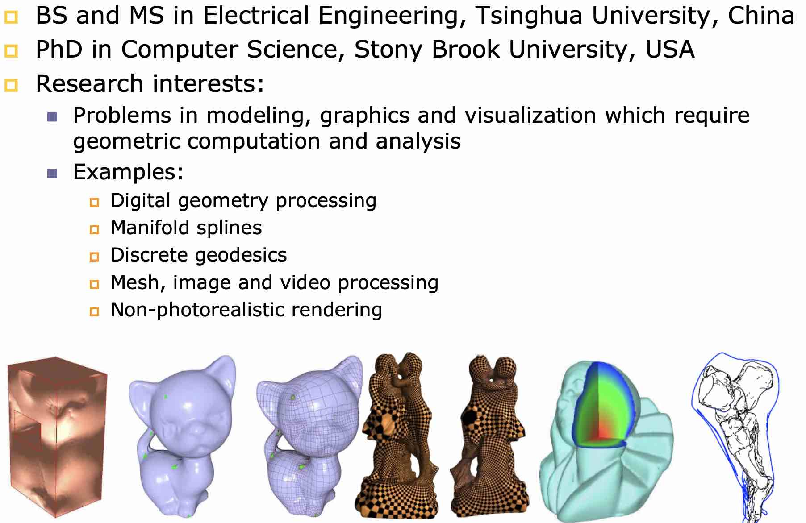
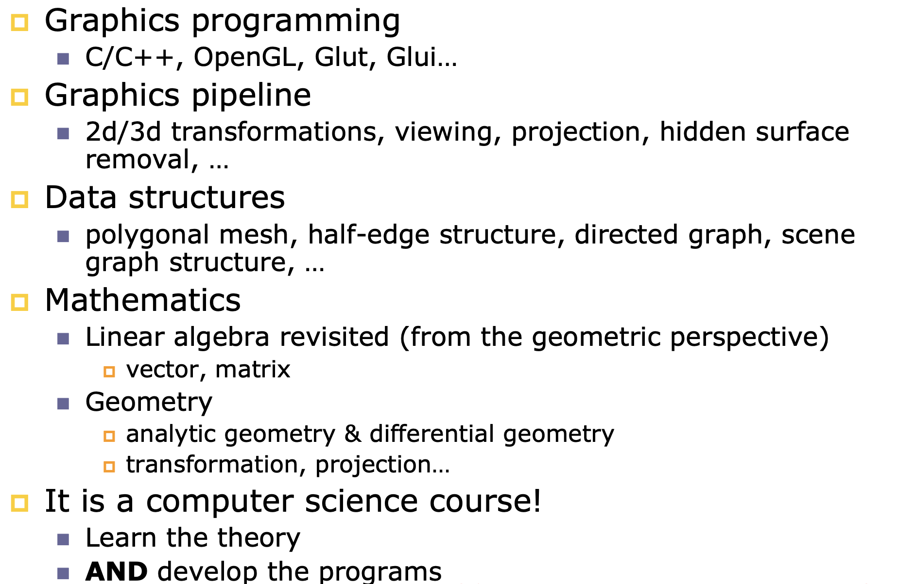
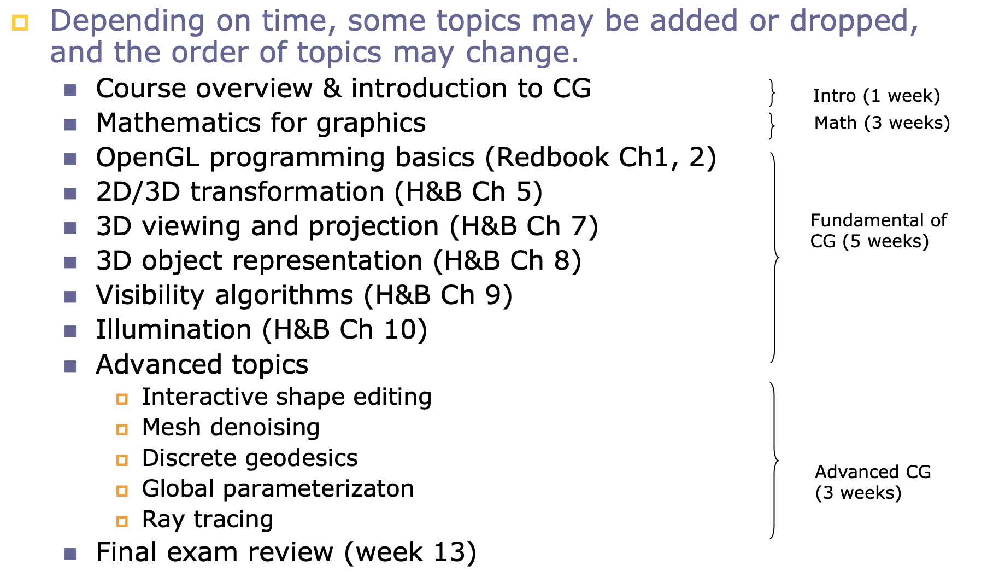
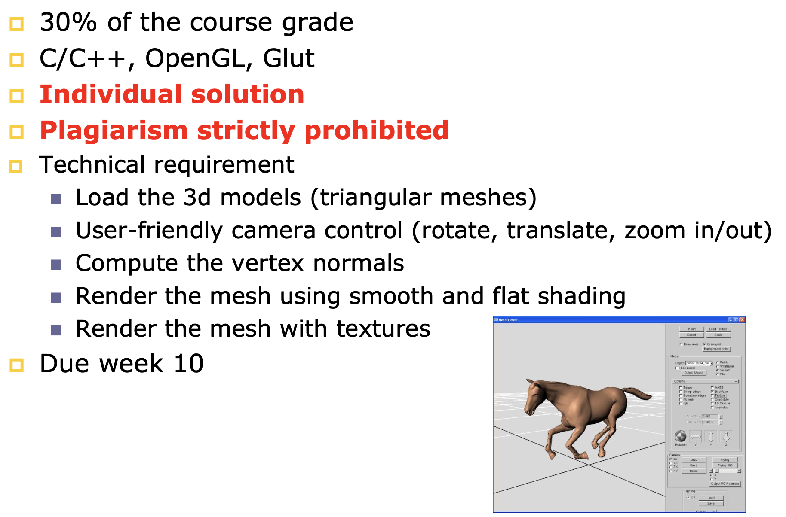

## DM6101 

Advanced Computer Graphics

### Instructors

**Associate Professor** [HE Ying](https://personal.ntu.edu.sg/yhe/)

  

### Course Objectives

* To give practical knowledge of the fundamentals of the graphics pipeline

* To learn the state-of-the-art graphics techniques

* To improve your programming skills

* To refresh your math knowledge

### What Learned In This Course

### Tentative Schedule

### Programming Assignment

