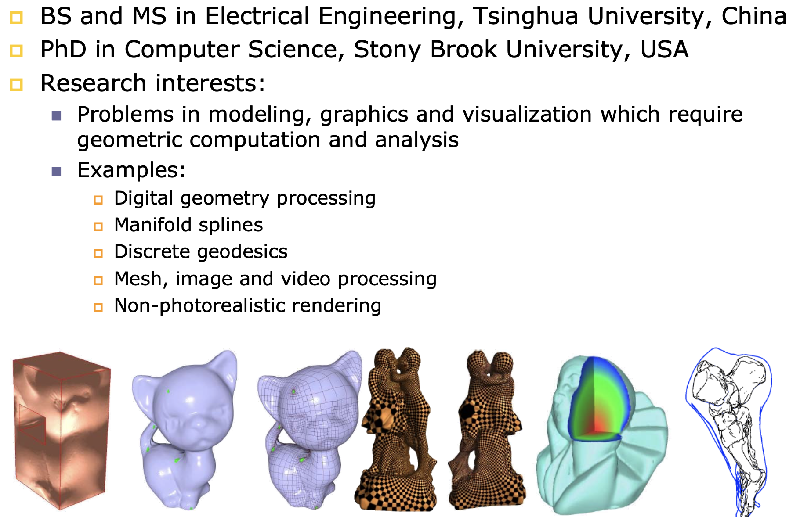

# DM6101 

Advanced Computer Graphics

# Instructors

Professor HE Ying

# Course Objectives

* To give practical knowledge of the fundamentals of the graphics pipeline

* To learn the state-of-the-art graphics techniques

* To improve your programming skills

* To refresh your math knowledge

# What Learned In This Course

# Tentative Schedule

# Programming Assignment

