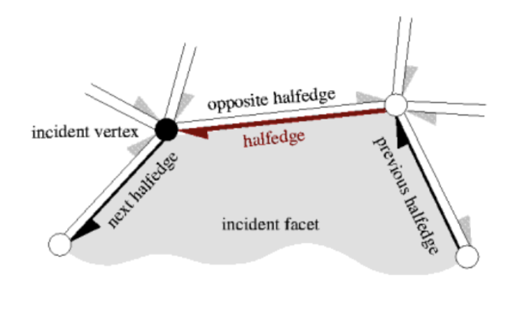
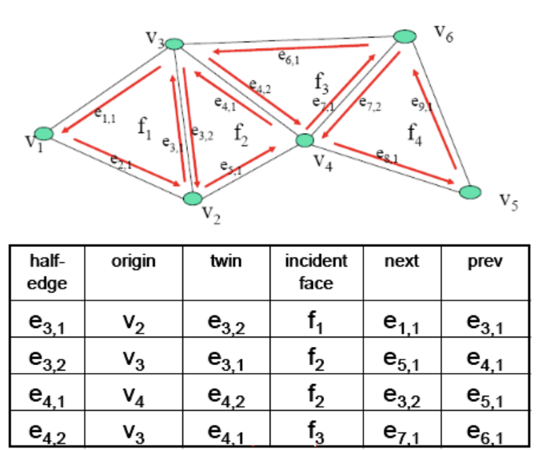
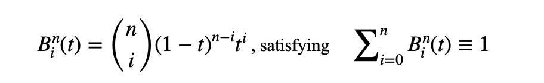

# Interactive Shape Editing

The disertation for the master degree on Digital Media Technology program.

### Features

#### 1. Interactive Shape Editing

  Interactive shape editing is an active field of research in computer graphics, and consequently a variety of different solutions were proposed to solve this problem.

#### 2. Free Form Deformation (FFD)

  Efficient and intuitive methods for three-dimensional shape design, modification, and animation are becoming increasingly important areas in computer graphics.

  The free-form deformations were designed to deal with some of these problems. These methods embed an object in a deformable region of space such that each point of the object has a unique parameterization that defines its position in the region.

#### 3. Free-Form Deformation Algorithm

  Free-Form Deformation (FFD) which based on trivariate Bernstein Polynomials is an approach to deform solid geometric models. The techniques involved can be used in CSG or B-rep solid modelling systems, to deform planes, quadrics, surfaces (B-spline parametric patches and implicit surface). It also has a property of preserving volume during deformations.

#### 4. Half-Edge Data Structure

  Half-edge data structure is an edge-centred data structure capable of maintaining incidence information of vertices, edges and faces, it is a common way to represent a polygon mesh which is a shared list of vertices and a list of faces storing pointers for its vertices. This representation is both convenient and efficient for many purposes.

  1.) Each edge is divided into two half-edges.  

  2.) Each half-edge has 5 references, as below:

    ① The face on left side (assume counter-clockwise order).

    ② The Previous half-edge in counter-clockwise order.

    ③ The next half-edge in counter-clockwise order.

    ④ The “twin” edge.

    ⑤ The starting vertex.
   
   

        
     &nbsp;&nbsp;&nbsp;&nbsp;&nbsp;&nbsp;&nbsp;&nbsp;&nbsp;&nbsp;&nbsp;&nbsp;&nbsp;&nbsp;&nbsp;&nbsp;&nbsp;&nbsp;&nbsp;&nbsp;&nbsp;&nbsp;&nbsp;
     
   

#### 5. Bernstein Polynomial

  Polynomials in Bernstein form were first used by Bernstein in a constructive proof for the Stone–Weierstrass approximation theorem. With the advent of computer graphics, Bernstein polynomials, restricted to the interval x ϵ[0, 1], became important in the form of Bézier curves.

  1.) The n + 1 Bernstein basis polynomials of degree n are

    
  
  2.) Binomial coefficient (“n-choose-i”)

  

  3.) The Lerp of lower degrees:

  

#### 6. De Casteljau Algorithm

  De Casteljau algorithm is a numerically stable way to evaluate polynomials in Bernstein form. And in the mathematical field of numerical analysis, de Casteljau's algorithm is a recursive method to evaluate polynomials in Bernstein form or Bézier curves.

#### 7. Free Form Deformation (FFD)

  The FFD is defined in terms of a tensor product trivariate Bernstein Polynomial. FFD is a technique for manipulating any shape in a free-form manner. It can be looked as a “rubber-like” deformation of space. Deformation can be modelled by deforming a regular grid; and it includes 2D-FFD and 3D-FFD. The deformation process can be described as below.

  Diagram

  1.) Local Coordinate System

  Diagram

  2.) Any vertex position X can be expressed

  Diagram

  3.) The local coordinates (s, t, u) of X can be calculated

  Diagram

  4.) every control point's position can be calculated

  Diagram

  5.) Deformed Coordinate

  The deformation is specified by moving the control point Pijk from their un-displaced, latticial positions. And the deformed function is defined by a trivariate tensor product Bernstein Polynomial, the new point Xffd of the arbitrary point X can be calculated by its local coordinates (s, t, u) according to the following trivariate Bernstein Polynomial equation.

Diagram

#### 8. Implementation Result

Diagram
