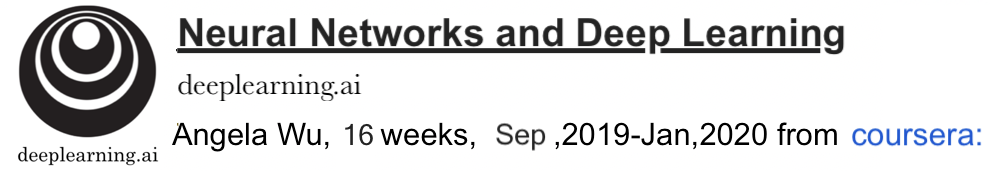
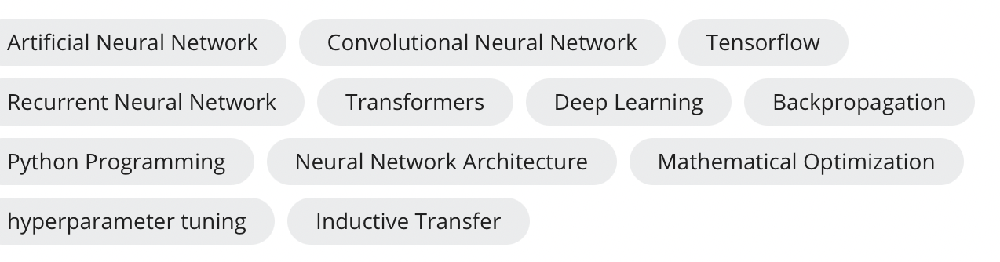

# Curriculum Vitae
 
## Personal Information

   

**Name:** Francis Luo    

**Cell Phone No:** 15221959360

**E-mail:** luo_xiawu@163.com

**WeChat:** francis2891

**Date of Birth:** June 15, 1979

**Nationality:** China

**Current Location:** Shanghai,China

**Marital Status:** Married

## Working Experience

**Senior Software Engineer III (Engineering | DevOps)**

Autodesk Asia Pte Ltd. (ASRD)  | Singapore

November 2011 ~ June 2021 (9 years 5 months)

**Software Engineer (Developer)**

Autodesk, Inc. (ACRD) | Shanghai, China

May 2005 ~ November 2011 (6 years 6 months) 

## Skills Summary

Learn about Computer Graphics, OpenGL

Familiar with C++, python, Perl, Batch, Groovy + UT

Familiar with the principles of basic data structures and algorithms

Learn about Java, Java Script, Java Servlet, Eclipse, Type Script, PHP, HTTPS, HTML, XML, CSS, JSON, ASP.net

Familiar with Jenkins, Git, Artifactory, CI-CD Pipeline, Perforce, Electrical Cloud

Learn about IaC, Docker, Ansible, AWS, Azure, Linux

Learn about SQL, MongoDB, Redis ActiveRecord|slice, AWS Dynamoid.Document

Learn about AI/ML basic theories, plus completed assignments

Familiar with Scrum, Agile, LUMA, OKR theories

## Training Experience

**Power Communication Skills** | April 13th, 2012

**Scrum Foundation and Agile Engineering Practice** | April 16th ~ 18th 2012

**Employee Leadership Program Training** | September 4th ~ 7th 2012

**Conflicts Management** | April 23rd, 2013

**Power Presentation Skills** | July 10th ~11th 2014

**Security Training** | January 4th, 2015

**Business English 2B** | Dec 2016 ~ Jan 2017, British Council  

**AWS Workshop: AMI creation using Packer** | July 1st, 2017

**AWS Workshop: Terraform** | July 21st ,2017

**AWS Technical Essentials** | April 23rd , 2018, Asia / Singapore

**AWS Summit Singapore 2019** | Nov 4th, 2019

**AWS Summit Online ASEAN 2020** | May 13th, 2020, Singapore

**OKR workshop** | May 23rd ,2019

**Agile Workshop** | Oct 11st, 2019

**Interview Bootcamp** | March 15th, 2021

## Education
  

**Nanyang Technological University | NTU**

Singapore

Master’s degree, Digital Media Technology, School of Computer Engineering

August 2012 ~ July 2014

 

**Jiangsu University of Science and Technology | JUST**

China

* Master’s degree, Computer Integrated Manufacturing Systems (CIMS), School of Mechanical Engineering

September 2002 ~ March 2005

* Bachelor’s degree, Mechanical Manufacture and Automation, School of Mechanical Engineering

September 1998 ~ July 2002

## E-Learning | ML&NNDL&AI

|Time|Contents||Time|Contents|
|-|-|-|-|-|
|W2|Linear Regression with Multiple Variables||W7|SVM|
|W3|Classification||W8|Clustering|
|W4|Neural Network||W9|Anomaly Detection|
|W5|CostFunction Backpropagation||W10|Gradient Descent with Large Datasets|
|W6|Evaluating Learning Algorithm||W11|Photo OCR|

More detailed [accomplishment](https://github.com/francislxw/cv/tree/main/ai-machinelearning)

  

The **Deep Learning Specialization** is a foundational program that will help you understand thcapabilities, challenges, and consequences of deep learning and prepare you to participate in the development of leading-edge AI technology. 
In this Specialization, you will build and train neural network architectures such as Convolutional Neural Networks, Recurrent Neural Networks, LSTMs, Transformers, and learn how to make them better with strategies such as Dropout, BatchNorm, Xavier/He initialization, and more. Get ready to master theoretical concepts and their industry applications using Python and TensorFlow and tackle real-world cases such as speech recognition, music synthesis, chatbots, machine translation, natural language processing, and more.
AI is transforming many industries. The Deep Learning Specialization provides a pathway for you to take the definitive step in the world of AI by helping you gain the knowledge and skills to level up your career. Along the way, you will also get career advice from deep learning experts from industry and academia. 
**Skills learned:**
 

More detailed [accomplishment](https://github.com/francislxw/cv/tree/main/ai-neuralnetworksdeeplearning)

## E-Practice

**leetcode exercise** @ https://leetcode-cn.com/u/lionsg/ | from Dec,2020 

 

## Detailed Working Experiences (<= 5 years)

**Two generations of Automation Build Process for Autodesk major desktop products**

I. Decouple VB build tool (pay for license) to PERL scripts by us, plus build dashboard, SCM: P4

II Decouple scripts to groovy/python, with Jenkins pipeline, plus build dashboard, SCM: Git + Artifactory

*Main Pipeline stages:*

* Initialize build, sync-source, update 3P, compile solutions, Digital Sign binaries, Create masters, Digital sign installers, UPI Register, Post Symbols, Post masters, post-build tasks.

* Automatically error checking from logs.

* Notify respective committers correctly.

**Mainly for the following products:**

Setup CI-CD pipeline for most major products like: 

Inventor, Vault, Civil3D, Factory Design Unities, ETO, Process Analysis etc.

**Infrastructure as Code (IaC)**

* Docker + Ansible to control all ECS machines +set up build environment (software version control)

* Implement dashboard to monitor build status of above listed products.

* Branch build scheduler for SWD team, to validate their code changes from their own branches

* Etc.

**React +Node.js front-end programming** 

Ruby-smal + OKTA (SAML2) to implement the <log in> user administrator identity confirmation

**Rest API implementation** | ruby | typescript | Redis + Sidekiq

* ci-services

* testcase.manage.service

* tcdb.services

* access.service

* etc.

**Communicate with #Slack**

Send build results to the slack channel http POST request (header, body, data)

**Amazon Web Services** | S3, SQS, Dynamoid, ’aws-sdk’, test/mocking
 
* AWS Credentials| AWSAccessKeyId | AWSSecretKey 
 
* AWS S3 (Simple Storage Service)| Buckets: $s3.bucket(ENV[‘AWS_S3_BUCKET’]).object(key)
 
* AWS SQS | Aws::SQS::Client.new 
 
* AWS Access Control | Block public access | Configuring cross-origin resource sharing (CORS)
 
* AWS Shoryuken | Super-efficient AWS SQS thread-based message processor | .configure_client/server
 
* AWS Dynamoid DB | gem 'dynamoid' | include Dynamoid::Document| Dynamoid.configure | rake dynamoid:create_tables
 
* gem 'aws-sdk'  | Aws::S3::Resource.new| Aws.config.update
 
* AWS LocalStack | A fully functional local AWS Cloud Stack for test/mocking framework | endpoint: 'http://localstack:4566'
 
**AWS Lambda**|AMI | SSM | EC2 instance | CloudFormation | boto3 | python-lambda awscli
 
* Amazon Machine Images (AMIs)
 
* Amazon Simple Systems Manager (SSM)
 
* Amazon Elastic Compute Cloud instance (EC2 instance)

**Hashicorp Terraform**|HCL| AWS Lambda | EC2 instance | python-lambda awscli
 
* HashiCorp 配置语言（HCL）

**Hashicorp Packer**
 
* Microsoft Azure | Azure Image Builder | python-adal | azure-functions | azure-identity | azure-mgmt-imagebuilder | azure-mgmt-resource
 
 ## More Detailed Working Experiences (> 5 years ago)
 
 * Projects for master’s degree of Computer Science @ NTU
 
 **Project Name:** Interactive Shape Editing
 
 ** Project Duration:** Aug 2013 ~ July 2014
 
 *Background: 
 
 This project is for my master degree on Digital Media Technology program of Nanyang Technological University, it’s accomplished under my supervisor’s instruction, it utilizes what I learned from DM6101 (Introduction to Computer Graphics) and DM6122 (3D Modeling and Reconstruction).
 
 *Project Description:
 
 Three-dimensional geometric models are the base data for applications in computer graphics, computer aided design, visualization, multimedia, and other related fields, the state-of-the-art interactive shape editing techniques become very popular in recent years, under such condition, and we propose this dissertation to perform some research on this area.
 
 *My Contributions:
1. Discuss with advisor, choose the topic, propose catalogues and ask him help to review then refine it.
 
2. Develop a pro-type of the Interactive Shape editing system, which includes open mesh file, create control points, free-form deformation etc. functions.
 
3. Draft contents of each chapter, compose the dissertation, it mainly includes the following contents:
 
1.) It firstly introduces the background of the interactive shape editing technique, and states the problem in this research area, based on this, we propose the objective and scope of the research, and we draft the organization of this dissertation.
 
2.)  Secondly, we investigate the related works on "Interactive shape editing" and "free-form deformation (FFD)", by reading most relative papers, we know what resolutions have been proposed by most researchers; learn about the Pros and Cons of every solution. In order to deeply understand the popular method 'linearization' used in the deformation, we choose free-form deformation (FFD) approach to perform researching and implementation.
 
3.) We mainly discuss the detailed implementation of the FFD application, includes the development environment, application’s structure information, the workflow diagrams for displaying model, create control points, free-form deformation, multithreading functions. We also give the relationship diagram of classes that are created in this FFD application and list some C++ pseudo code. During the implementation, we apply several advanced technologies, e.g., apply half edge data structure to store mesh data, which can improve the efficiency of getting vertex local information during deformation; On the basis of vertex local coordinate, we utilize the de Casteljau algorithm, to easily calculate the deformed coordinate with the Burnstein Polynomial form, etc.
 
4.) After presenting the output of every function in this FFD application, we perform some discussion on 'how to improve the applicant's performance’ and propose 'multithreading' technique to resolve the 'long time cost in calculating deformed coordinates' issue. Based on the experiment results, we conclude that the 'multithreading' technique can improve the performance of the FFD application very much, especially for large scale models.
Result: The dissertation passed the final review of NTU graduate committee
