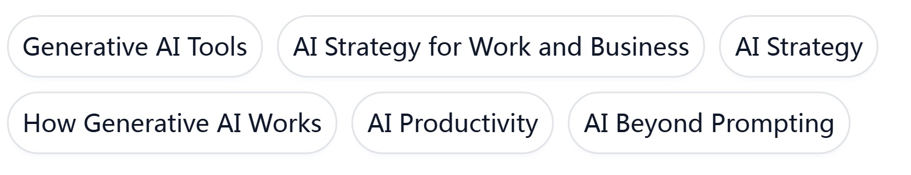

## Agentic AI

)  

**Agentic AI** Instructed by AI pioneer Andrew Ng, Generative AI for Everyone offers his unique perspective on empowering you and your work with generative AI. Andrew will 
guide you through how generative AI works and what it can (and can’t) do. It includes hands-on exercises where you’ll learn to use generative AI to help in day-to-day work and 
receive tips on effective prompt engineering, as well as learning how to go beyond prompting for more advanced uses of AI.
You’ll delve into real-world applications and learn common use cases, and get hands-on time with generative AI tools to put your knowledge into action, and gain insight into AI’s 
impact on both business and society.
This course was created to ensure everyone can be a participant in our AI-powered future.

**Skills learned:**

 
 
# Course Syllabus
**Module 1: Introduction to Agentic Workflows**
  * What is agentic AI & Degress of AI autonomy
  * Benefits of agentic AI
  * Agentic AI Applications
  * Task decomposition:Identifying the steps in a workflow
  * Evaluation agentic AI(evals)
  * Agentic design patterns

**Module 2: Reflection Design Pattern**
  * Reflection to improve outputs of a task
  * Why not just direct generation
  * Chart generation workflow
  * Evaluating the impact of reflection
  * Use external feedback
  * Lab1: Chart Generation
  * Lab2: Improving SQL Generation with Reflection

**Module 3: Tool use**
  * Creating a tool & Tool syntax
  * Code execution
  * MCP
  * Lab1: Turning functions into tools
  * Lab2: Email Assistant Workflow

**Module 4: Practical Tips for Building Agentic AI**
  * Evaluations(evals)
  * Error analysis and prioritizing next steps
  * Component-level evaluations
  * How to address problems you identify
  * Latency, cost optimization
  * Lab1:Adding a component-level eval to the research workflow
    
**Module 5: Patterns for Highly Autonomous Agents**
  * Planning workflows
  * Creating and executing LLM plans
  * Planning with code execution
  * Muliti-agentic workflows
  * Communication patterns for multi-agent systems
  * Lab1: Customer Service Agent
  * Lab2: Market Research Team
  * Assignment: Agentic Workflows
    
