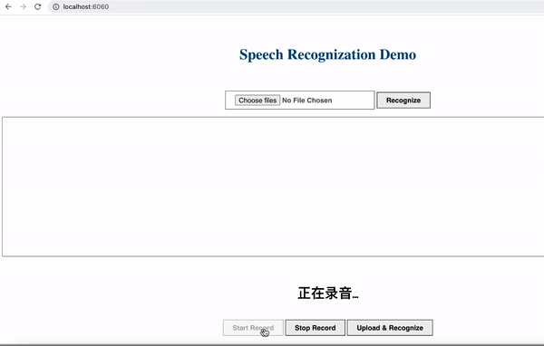

# Speech Recognition - Chinese Audio to Chinese Words
This project is to learn and practise recongnizing Chinese Audio and transfering it to the Chinese words, accurancy is over 80%, can be deployed easily.

* Audio recording from terminal in the client webpage (SampleRate:16000hz,bitRate:16kbps)
* Transfer to Chinese words timely in the server, show results to the front web page.



## Techniques
* Client: Docker(docker compose) + Nginx(Reverse Proxy) + Tomcat, java servelet + eclipse, js + html
* Server: Docker(docker compose) + Nginx(Reverse Proxy) + Django + djangorestframework, js + html, python, tensorflow, kreas
* Audio encoding: WAV encoding headers + PCM data, refer [details](https://www.freesion.com/article/3558299162/)
* Deep Convolutional neural network, [CNN](https://www.coursera.org/learn/convolutional-neural-networks)
* Long-Short Term Memory neural network, [LSTM](https://www.cnblogs.com/wangduo/p/6773601.html)
* attention mechanism [AM](https://www.cnblogs.com/robert-dlut/p/5952032.html)
* Connectionist Temporal Classification, [CTC](https://www.cnblogs.com/shiyublog/p/10493348.html)


## How to Setup DEV Environment
### On Mac/Linux/Windows 10
1. Install Docker. refer [here](https://github.com/tensorflow/tensorflow/blob/master/tensorflow/tools/dockerfiles/dockerfiles/cpu.Dockerfile) for the cpu dockerfile generation.
2. Clone speech_recognition repository.
#### I. Client
3. In the speech_recognition dir, run below script to build docker image for testing:
    ```
    docker build -t speech_recognition .
    ```
4. In the speech_recognition dir, run below scrip to launch the project:

    a) For Mac/Linux:
    ```
    bash run_ai.sh
    ```
    b) For Windows 10: 
    ```
    run_ai.bat
    ```
#### II. Web
5. In the speech_recognition dir, run below script to build docker image for testing:
    ```
    docker build -t speech_recognition .
    ```
6. In the speech_recognition dir, run below scrip to launch the project:

    a) For Mac/Linux:
    ```
    bash run_ai.sh
    ```
    b) For Windows 10: 
    ```
    run_ai.bat
    ```
5. python version:3.6~3.8 (V3.6 here)

## Experiment Result

```
luoxi@XIAWUs-MacBook-Pro 2.1.Operations_on_word_vectors_word_embeddings % ./run_ai.sh
----deep-learning:wordvectors-embeddings----
cosine_similarity(father, mother) =  0.8909038442893618
cosine_similarity(ball, crocodile) =  0.2743924626137942
cosine_similarity(france - paris, rome - italy) =  -0.67514793081742
italy -> italian :: spain -> spanish
india -> delhi :: japan -> tokyo
man -> woman :: boy -> girl
small -> smaller :: big -> competitors
[-0.087144    0.2182     -0.40986    -0.03922    -0.1032      0.94165
 -0.06042     0.32988     0.46144    -0.35962     0.31102    -0.86824
  0.96006     0.01073     0.24337     0.08193    -1.02722    -0.21122
  0.695044   -0.00222     0.29106     0.5053     -0.099454    0.40445

```
# Reference
* [PCM Data Instroduction](https://www.freesion.com/article/3558299162/)
* [ASRT_SpeechRecognition](https://gitee.com/ailemon/ASRT_SpeechRecognition)
* [ASRT Speech Reconition Sys Doc](https://asrt.ailemon.net/docs/)
* [Audio format Instros & Translation from PCM to WAV](https://www.freesion.com/article/3558299162/)
