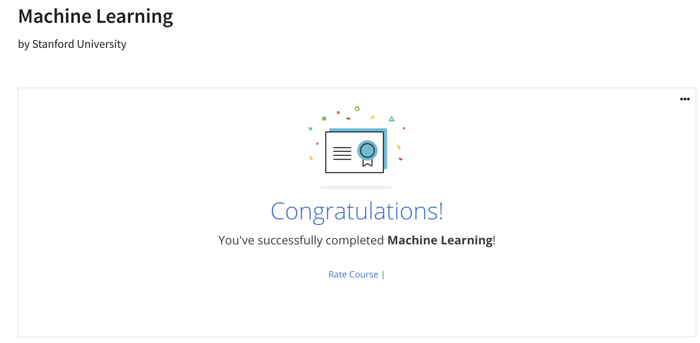

## Courses
 

|Time|Contents||Time|Contents|
|-|-|-|-|-|
|W2|Linear Regression with Multiple Variables||W7|SVM|
|W3|Classification||W8|Clustering|
|W4|Neural Network||W9|Anomaly Detection|
|W5|CostFunction Backpropagation||W10|Gradient Descent with Large Datasets|
|W6|Evaluating Learning Algorithm||W11|Photo OCR|

## Accomplishment

