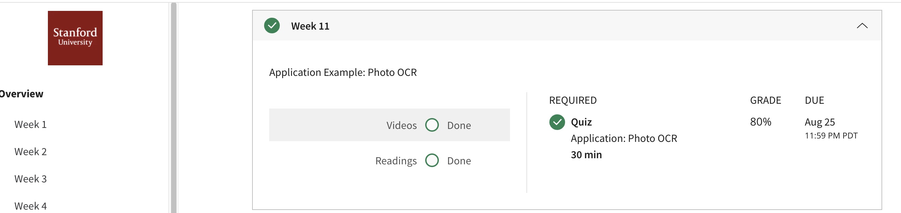

## Application Example: Photo OCR
Identifying and recognizing objects, words, and digits in an image is a challenging task. We discuss how a pipeline can be built to tackle this problem and how to analyze and improve the performance of such a system.
## Contents 
* Problem Description and Pipeline
* Sliding Windows
* Getting Lots of Data and Artificial Data
* Ceiling Analysis: What Part of the Pipeline to Work on Next
* Summary and Thank You
## Accomplishment

