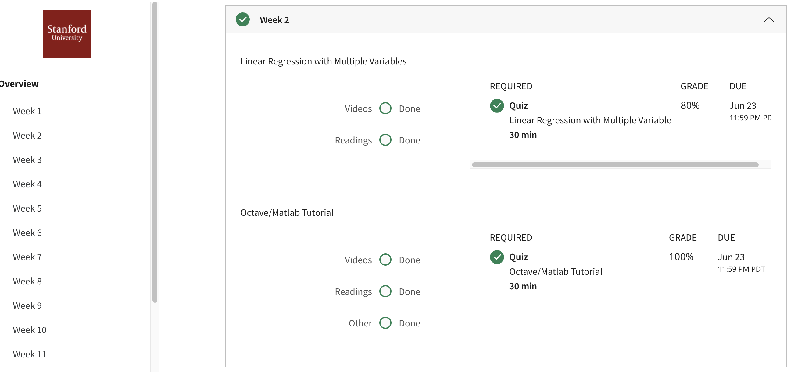

## Linear Regression with Multiple Variables
Linear regression predicts a real-valued output based on an input value. We discuss the application of linear regression to housing price prediction, present the notion of a cost function, and introduce the gradient descent method for learning.
## Course Syllabus
* Model Representation
* Cost Function
* Cost Function - Intuition I
* Cost Function - Intuition II
* Gradient Descent
* Gradient Descent Intuition
* Gradient Descent For Linear Regression
## Accomplishment

