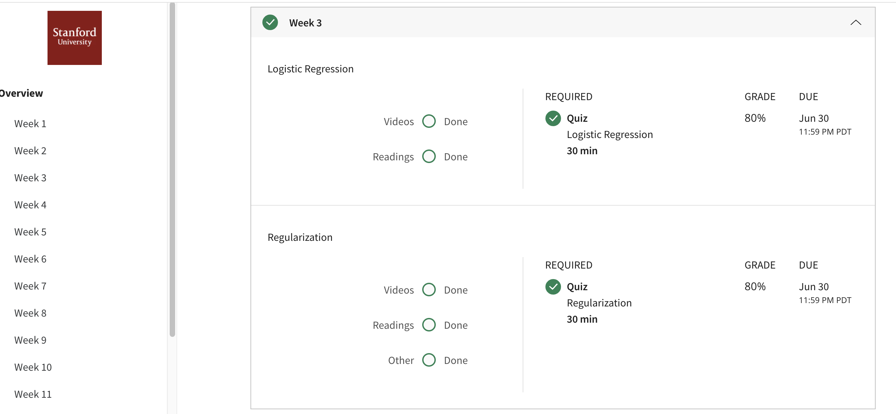

## Logistic Regression
Logistic regression is a method for classifying data into discrete outcomes. For example, we might use logistic regression to classify an email as spam or not spam. In this module, we introduce the notion of classification, the cost function for logistic regression, and the application of logistic regression to multi-class classification.
## Contents 
* Classification
* Hypothesis Representation
* Decision Boundary
* Cost Function
* Simplified Cost Function and Gradient Descent
* Advanced Optimization
* Multiclass Classification: One-vs-all
## Accomplishment

