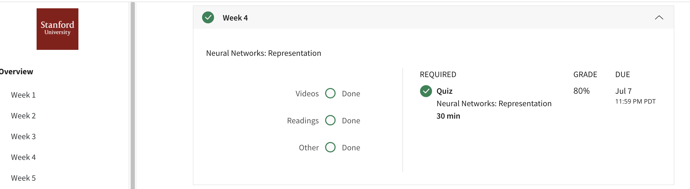

## Neural Networks: Representation
Neural networks is a model inspired by how the brain works. It is widely used today in many applications: when your phone interprets and understand your voice commands, it is likely that a neural network is helping to understand your speech; when you cash a check, the machines that automatically read the digits also use neural networks.
## Contents 
* Non-linear Hypotheses
* Neurons and the Brain
* Model Representation I
* Model Representation II
* Examples and Intuitions I
* Examples and Intuitions II
* Multiclass Classification
## Accomplishment

