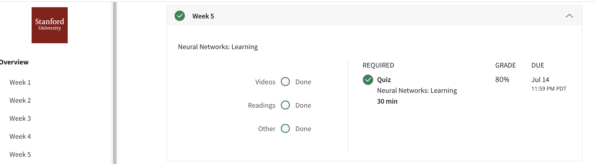

## Neural Networks: Learning
In this module, we introduce the backpropagation algorithm that is used to help learn parameters for a neural network. At the end of this module, you will be implementing your own neural network for digit recognition.
## Contents 
* Cost Function
* Backpropagation Algorithm
* Backpropagation Intuition
* Implementation Note: Unrolling Parameters
* Gradient Checking
* Random Initialization
* Putting It Together
* Autonomous Driving
## Accomplishment

