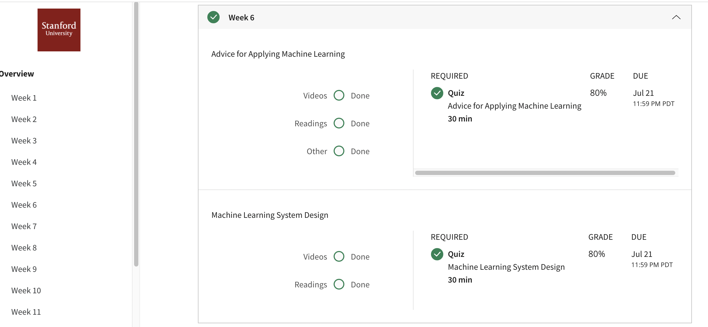

## Advice for Applying Machine Learning
Applying machine learning in practice is not always straightforward. In this module, we share best practices for applying machine learning in practice, and discuss the best ways to evaluate performance of the learned models.
## Contents 
* Deciding What to Try Next
* Evaluating a Hypothesis
* Model Selection and Train/Validation/Test Sets
* Diagnosing Bias vs. Variance
* Regularization and Bias/Variance
* Learning Curves
* Deciding What to Do Next Revisited
## Accomplishment

