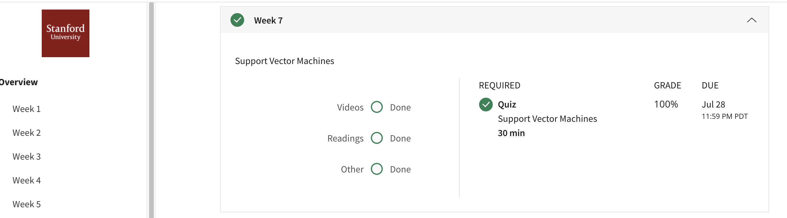

## Support Vector Machines
Support vector machines, or SVMs, is a machine learning algorithm for classification. We introduce the idea and intuitions behind SVMs and discuss how to use it in practice.
## Contents 
* Optimization Objective
* Large Margin Intuition
* Mathematics Behind Large Margin Classification
* Kernels I
* Kernels II
* Using An SVM
## Accomplishment

