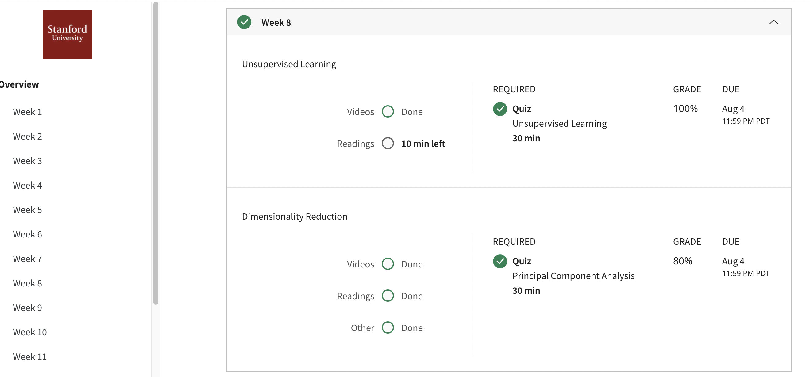

## I.Unsupervised Learning
We use unsupervised learning to build models that help us understand our data better. We discuss the k-Means algorithm for clustering that enable us to learn groupings of unlabeled data points.
## Contents 
* Unsupervised Learning: Introduction
* K-Means Algorithm
* Optimization Objective
* Random Initialization
* Choosing the Number of Clusters
## II.Dimensionality Reduction
In this module, we introduce Principal Components Analysis, and show how it can be used for data compression to speed up learning algorithms as well as for visualizations of complex datasets.
## Contents 
* Motivation I: Data Compression
* Motivation II: Visualization
* Principal Component Analysis Problem Formulation
* Principal Component Analysis Algorithm
* Reconstruction from Compressed Representation
* Choosing the Number of Principal Components
* Advice for Applying PCA12m
## Accomplishment

