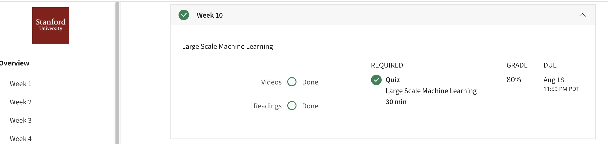

## Large Scale Machine Learning
Machine learning works best when there is an abundance of data to leverage for training. In this module, we discuss how to apply the machine learning algorithms with large datasets.
## Contents 
* Learning With Large Datasets
* Stochastic Gradient Descent
* Mini-Batch Gradient Descent
* Stochastic Gradient Descent Convergence
* Online Learning
* Map Reduce and Data Parallelism
## Accomplishment

