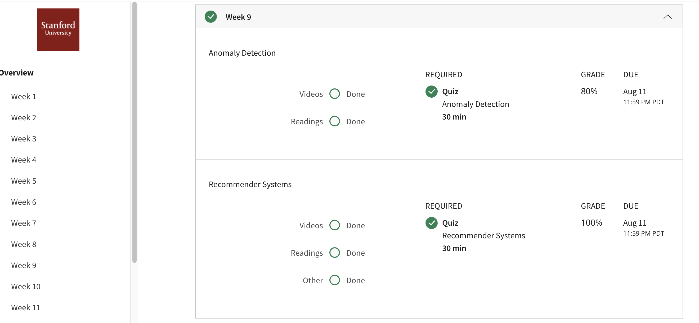

## Anomaly Detection
Given a large number of data points, we may sometimes want to figure out which ones vary significantly from the average. 
For example, in manufacturing, we may want to detect defects or anomalies. We show how a dataset can be modeled using a Gaussian distribution, and how the model can be used for anomaly detection.
## Contents
* Problem Motivation
* Gaussian Distribution
* Algorithm
* Developing and Evaluating an Anomaly Detection System
* Anomaly Detection vs. Supervised Learning
* Choosing What Features to Use
* Multivariate Gaussian Distribution
* Anomaly Detection using the Multivariate Gaussian Distribution
* ## Accomplishment

