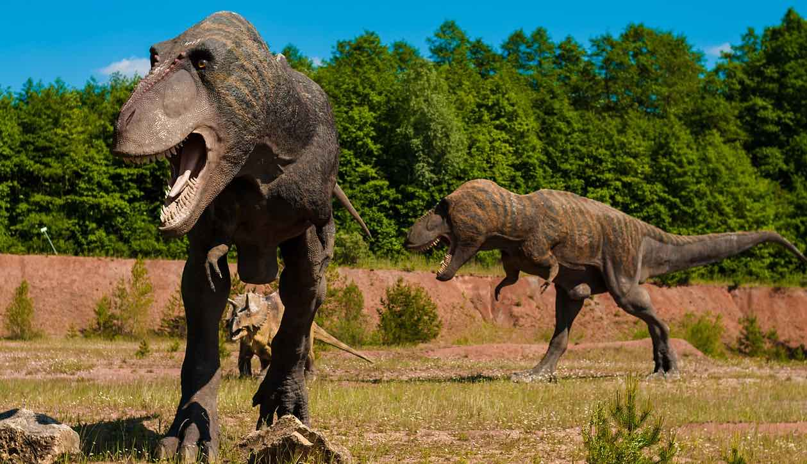
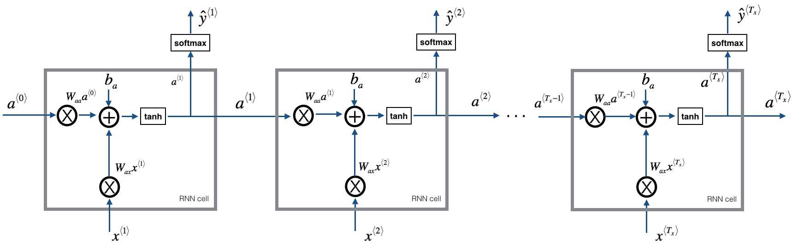
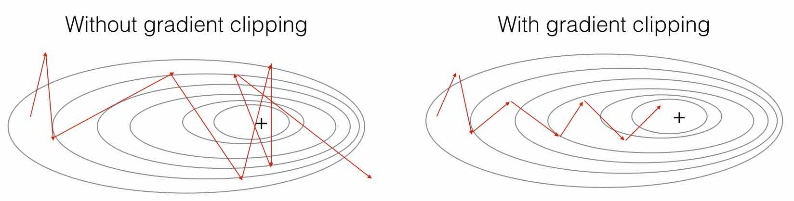
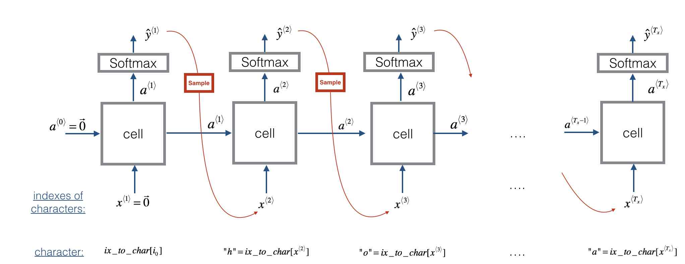

## Dinosaurus Names Generation with Recurrent Neural Network

This project contains python and library scripts of Recurrent Neural Network, the model outputs random-looking characters at the first iteration. After a few thousand iterations, this model generates plausible dinosaur names towards the end of the training.



## Techniques
### Recurrent Neural Network
* Forward propagation to compute the loss function
* Backward propagation to compute the gradients with respect to the loss function
* Clip the gradients to avoid exploding gradients
* Using the gradients, update parameters with the gradient descent update rule.



## Gradient Clipping



## Sampling



## How to Setup DEV Environment
### On Mac/Linux/Windows 10
1. Install Docker.
2. Clone the ci-pipeline repository.
3. In the 1.dinosaurus_name dir, run below script to build docker image for testing:
    ```
    docker build -t dinosaurus-name .
    ```
4. In the 1.dinosaurus_name dir, run below scrip to run unit test:

    a) For Mac/Linux:
    ```
    bash run_ai.sh
    ```
    b) For Windows 10: 
    ```
    run_ai.bat
    ```
## Experiment Result
```
[luoxi@XIAWUs-MacBook-Pro 1.Dinosaurus_Island_Name % ./run_ai.sh 
----ai:dinosaurus_island_name----
python: /usr/bin/python3.6-config /usr/bin/python3.6 /usr/bin/python3.6m /usr/bin/python3.6m-config /usr/lib/python3.8 /usr/lib/python3.6 /usr/lib/python3.7 /etc/python3.6 /usr/local/lib/python3.6 /usr/include/python3.6 /usr/include/python3.6m
There are 19909 total characters and 27 unique characters in your data.
['\n', 'a', 'b', 'c', 'd', 'e', 'f', 'g', 'h', 'i', 'j', 'k', 'l', 'm', 'n', 'o', 'p', 'q', 'r', 's', 't', 'u', 'v', 'w', 'x', 'y', 'z']
{   0: '\n',
    1: 'a',
    2: 'b',
    3: 'c',
    4: 'd',
    5: 'e',
    6: 'f',
    7: 'g',
    8: 'h',
    9: 'i',
    10: 'j',
    11: 'k',
    12: 'l',
    13: 'm',
    14: 'n',
    15: 'o',
    16: 'p',
    17: 'q',
    18: 'r',
    19: 's',
    20: 't',
    21: 'u',
    22: 'v',
    23: 'w',
    24: 'x',
    25: 'y',
    26: 'z'}
gradients["dWaa"][1][2] = 10.0
gradients["dWax"][3][1] = -10.0
gradients["dWya"][1][2] = 0.2971381536101662
gradients["db"][4] = [10.]
gradients["dby"][1] = [8.45833407]
gradients["dWaa"][1][2] = 5.0
gradients["dWax"][3][1] = -5.0
gradients["dWya"][1][2] = 0.2971381536101662
gradients["db"][4] = [5.]
gradients["dby"][1] = [5.]
matrix1 
 [[1 1]
 [2 2]
 [3 3]] 

matrix2 
 [[0]
 [0]
 [0]] 

vector1D 
 [1 1] 

vector2D 
 [[1]
 [1]]
Multiply 2D and 1D arrays: result is a 1D array
 [2 4 6]
Multiply 2D and 2D arrays: result is a 2D array
 [[2]
 [4]
 [6]]
Adding (3 x 1) vector to a (3 x 1) vector is a (3 x 1) vector
 This is what we want here!
 [[2]
 [4]
 [6]]
Adding a (3,) vector to a (3 x 1) vector
 broadcasts the 1D array across the second dimension
 Not what we want here!
 [[2 4 6]
 [2 4 6]
 [2 4 6]]
Sampling:
list of sampled indices:
 [12, 17, 24, 14, 13, 9, 10, 22, 24, 6, 13, 11, 12, 6, 21, 15, 21, 14, 3, 2, 1, 21, 18, 24, 7, 25, 6, 25, 18, 10, 16, 2, 3, 8, 15, 12, 11, 7, 1, 12, 10, 2, 7, 7, 0]
list of sampled characters:
 ['l', 'q', 'x', 'n', 'm', 'i', 'j', 'v', 'x', 'f', 'm', 'k', 'l', 'f', 'u', 'o', 'u', 'n', 'c', 'b', 'a', 'u', 'r', 'x', 'g', 'y', 'f', 'y', 'r', 'j', 'p', 'b', 'c', 'h', 'o', 'l', 'k', 'g', 'a', 'l', 'j', 'b', 'g', 'g', '\n']
Loss = 126.50397572165376
gradients["dWaa"][1][2] = 0.19470931534713945
np.argmax(gradients["dWax"]) = 93
gradients["dWya"][1][2] = -0.007773876032002764
gradients["db"][4] = [-0.06809825]
gradients["dby"][1] = [0.01538192]
a_last[4] = [-1.]
Iteration: 0, Loss: 23.087336

Nkzxwtdmfqoeyhsqwasjkjvu
Kneb
Kzxwtdmfqoeyhsqwasjkjvu
Neb
Zxwtdmfqoeyhsqwasjkjvu
Eb
Xwtdmfqoeyhsqwasjkjvu


Iteration: 2000, Loss: 27.884160

Liusskeomnolxeros
Hmdaairus
Hytroligoraurus
Lecalosapaus
Xusicikoraurus
Abalpsamantisaurus
Tpraneronxeros


Iteration: 4000, Loss: 25.901815

Mivrosaurus
Inee
Ivtroplisaurus
Mbaaisaurus
Wusichisaurus
Cabaselachus
Toraperlethosdarenitochusthiamamumamaon


Iteration: 6000, Loss: 24.608779

Onwusceomosaurus
Lieeaerosaurus
Lxussaurus
Oma
Xusteonosaurus
Eeahosaurus
Toreonosaurus


Iteration: 8000, Loss: 24.070350

Onxusichepriuon
Kilabersaurus
Lutrodon
Omaaerosaurus
Xutrcheps
Edaksoje
Trodiktonus


Iteration: 10000, Loss: 23.844446

Onyusaurus
Klecalosaurus
Lustodon
Ola
Xusodonia
Eeaeosaurus
Troceosaurus


Iteration: 12000, Loss: 23.291971

Onyxosaurus
Kica
Lustrepiosaurus
Olaagrraiansaurus
Yuspangosaurus
Eealosaurus
Trognesaurus


Iteration: 14000, Loss: 23.382338

Meutromodromurus
Inda
Iutroinatorsaurus
Maca
Yusteratoptititan
Ca
Troclosaurus


Iteration: 16000, Loss: 23.285253

Meutroklasaurus
Indaaeros
Itrsaurus
Maca
Yuspanesaurus
Caadropeclus
Trodon


Iteration: 18000, Loss: 22.815638

Phyusaurus
Mela
Mystonosaurus
Pegamosaurus
Yusrephosaurus
Eialosaurus
Trolonosaurus


Iteration: 20000, Loss: 23.002387

Onyusaurus
Lohaafrrahanurus
Lvtrohibosaurus
Olaacosaurus
Yusocheronydros
Elaeosaurus
Trrangosaurus


Iteration: 22000, Loss: 22.772792

Piusus
Midcaerosaurus
Musus
Pedaeropa
Yuspeodon
Fcaeror
Trocerator


Iteration: 24000, Loss: 22.625883

Ngwsskerasaurus
Kracaesrna
Lurus
Ndabasaurus
Yuromemisaurus
Eiaeroradosaurus
Troenathevermochimisechylyinanaltagaceratops


Iteration: 26000, Loss: 22.731942

Nivosaurus
Liceccton
Lustodontonyosaurus
Ola
Xtrodon
Eg
Trohiciraurus


Iteration: 28000, Loss: 22.599213

Pitrsaurus
Mice
Mutusaurus
Pacaisia
Wtrogomimasaurus
Eiacosaurus
Trrasaurus


Iteration: 30000, Loss: 22.528599

Phyuscephondys
Megabascgachusreimus
Musyoenethites
Pacalosaurus
Wustapjosaurus
Eg
Trocomis


Iteration: 32000, Loss: 22.397872

Onyxus
Llacairopcanteraptor
Mustraphonax
Pacairopbantitan
Wurnanasaurus
Eiahisaurus
Trianasaurus


Iteration: 34000, Loss: 22.448608

Mawtosaurus
Jhacagropa
Kurosaurus
Macaishuraptitan
Wrosaurus
Eiaeosaurus
Trokbaosaurus
```
