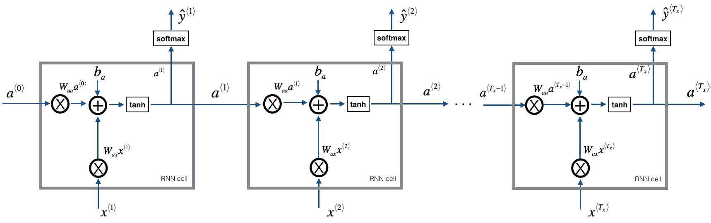

# Writing like Shakespeare by Long Short Term Memory (LSTM)

This project is to generate Shakespeare poems by using a collection of Shakespearian poems with LSTM. 

Using LSTM cells, you can learn longer term dependencies that span many characters in the text--e.g., where a character appearing somewhere a sequence can influence what should be a different character much much later in the sequence.

## Techniques
* Use LSTMs to capture longer-range dependencies
* The model is a deeper, stacked LSTM model (2 layer)
* Using Keras instead of python to simplify the code.




## How to Setup DEV Environment
### On Mac/Linux/Windows 10
1. Install Docker.
2. Clone the shakespeare-poems repository.
3. In the 2.Shakespeare_poems dir, run below script to build docker image for testing:
    ```
    docker build -t shakespeare-poem .
    ```
4. In the 1.dinosaurus_name dir, run below scrip to run unit test:

    a) For Mac/Linux:
    ```
    bash run_ai.sh
    ```
    b) For Windows 10: 
    ```
    run_ai.bat
    ```
5. python version >= 3.7
## Experiment Result


   
