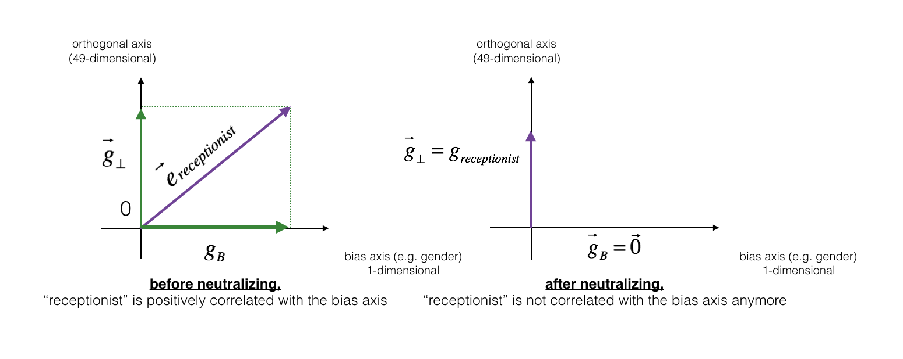

# Operations on word vectors - word embeddings
This project is to learn and practise word embedding relative knowledge. We will even be able to listen to your own music at the end of the assignment. 

* Load pre-trained word vectors, and measure similarity using cosine similarity
* Use word embeddings to solve word analogy problems such as Man is to Woman as King is to __.
* Modify word embeddings to reduce their gender bias


## Techniques
* one-hot vectors do not do a good job of capturing the level of similarity between words (every one-hot vector has the same Euclidean 
  distance from any other one-hot vector).
* Embedding vectors such as GloVe vectors provide much more useful information about the meaning of individual words.
* Cosine similarity: is a good way to compare the similarity between pairs of word vectors, L2 (Euclidean) distance also works.
* For NLP applications, using a pre-trained set of word vectors is often a good way to get started..
* Debiasing word vectors




## How to Setup DEV Environment
### On Mac/Linux/Windows 10
1. Install Docker. refer [here](https://github.com/tensorflow/tensorflow/blob/master/tensorflow/tools/dockerfiles/dockerfiles/cpu.Dockerfile) for the cpu dockerfile generation.
2. Clone the wordvectors-embeddings repository.
3. In the wordvectors-embeddings dir, run below script to build docker image for testing:
    ```
    docker build -t wordvectors-embeddings .
    ```
4. In the wordvectors-embeddings dir, run below scrip to launch the project:

    a) For Mac/Linux:
    ```
    bash run_ai.sh
    ```
    b) For Windows 10: 
    ```
    run_ai.bat
    ```
5. python version:3.6~3.8 (V3.6 here)
## Experiment Result

```
luoxi@XIAWUs-MacBook-Pro 2.1.Operations_on_word_vectors_word_embeddings % ./run_ai.sh
----deep-learning:wordvectors-embeddings----
cosine_similarity(father, mother) =  0.8909038442893618
cosine_similarity(ball, crocodile) =  0.2743924626137942
cosine_similarity(france - paris, rome - italy) =  -0.67514793081742
italy -> italian :: spain -> spanish
india -> delhi :: japan -> tokyo
man -> woman :: boy -> girl
small -> smaller :: big -> competitors
[-0.087144    0.2182     -0.40986    -0.03922    -0.1032      0.94165
 -0.06042     0.32988     0.46144    -0.35962     0.31102    -0.86824
  0.96006     0.01073     0.24337     0.08193    -1.02722    -0.21122
  0.695044   -0.00222     0.29106     0.5053     -0.099454    0.40445
  0.30181     0.1355     -0.0606     -0.07131    -0.19245    -0.06115
 -0.3204      0.07165    -0.13337    -0.25068714 -0.14293    -0.224957
 -0.149       0.048882    0.12191    -0.27362    -0.165476   -0.20426
  0.54376    -0.271425   -0.10245    -0.32108     0.2516     -0.33455
 -0.04371     0.01258   ]
List of names and their similarities with constructed vector:
john -0.23163356145973724
marie 0.31559793539607295
sophie 0.3186878985941879
ronaldo -0.3124479685032943
priya 0.17632041839009405
rahul -0.1691547103923171
danielle 0.24393299216283895
reza -0.07930429672199549
katy 0.2831068659572614
yasmin 0.2331385776792876
Other words and their similarities:
lipstick 0.27691916256382665
guns -0.18884855678988982
science -0.06082906540929698
arts 0.00818931238588036
literature 0.0647250443345993
warrior -0.20920164641125283
technology -0.13193732447554296
fashion 0.03563894625772697
teacher 0.1792092343182566
engineer -0.0803928049452407
pilot 0.0010764498991917165
computer -0.10330358873850501
singer 0.18500518136496288
cosine similarity between receptionist and g, before neutralizing:  0.3307794175059374
cosine similarity between receptionist and g, after neutralizing:  -7.42906299757222e-17
cosine similarities before equalizing:
cosine_similarity(word_to_vec_map["man"], gender) =  -0.11711095765336829
cosine_similarity(word_to_vec_map["woman"], gender) =  0.3566661884627036

cosine similarities after equalizing:
cosine_similarity(e1, gender) =  -0.7004364289309384
cosine_similarity(e2, gender) =  0.7004364289309386
```
