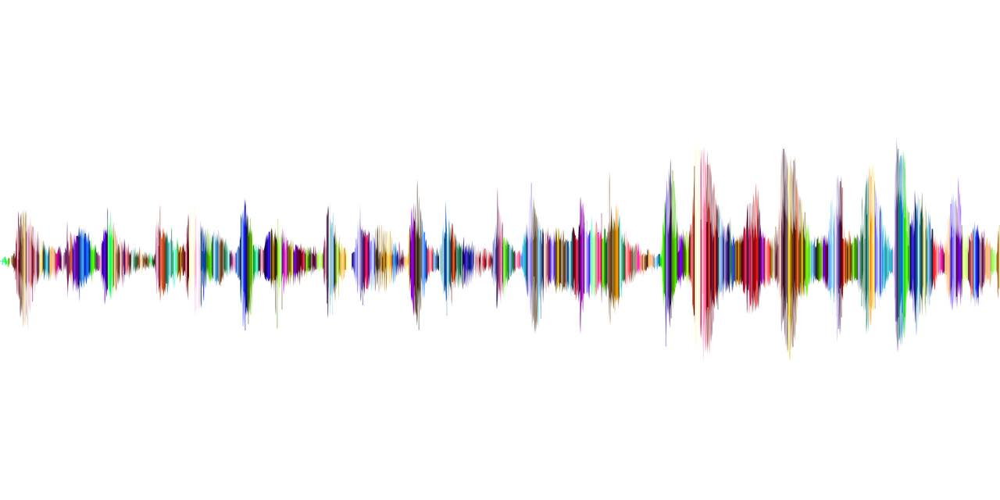

# Trigger Word Detection/Keyword Detection/Wake Word Detection
This project will construct a speech dataset and implement an algorithm for trigger word detection.

Perhaps you can also extend it to run on your laptop so that every time you say "activate" it starts up your favorite app, 
or turns on a network connected lamp in your house, or triggers some other event?



## Techniques
* Structure a speech recognition project
* Synthesize and process audio recordings to create train/dev datasets
* Train a trigger word detection model and make predictions
* Use audio sampled at 44100 Hertz，means the microphone gives us 44,100 numbers per second
* The spectrogram we computed tells us how much different frequencies are present in an audio clip at any moment in time.
* Trigger word detection that updating several consecutive time steps can make the training data more balanced
* Any newly inserted segment doesn't overlap with previously inserted segments.
* Build a network that will ingest a spectrogram and output a signal when it detects the trigger word.
* F1 score or Precision/Recall
* non-max suppression


## How to Setup DEV Environment
### On Mac/Linux/Windows 10
1. Install Docker. refer [here](https://github.com/tensorflow/tensorflow/blob/master/tensorflow/tools/dockerfiles/dockerfiles/cpu.Dockerfile) for the cpu dockerfile generation.
2. Clone the emojify repository.
3. In the Trigger_word_detection dir, run below script to build docker image for testing:
    ```
    docker build -t emojify .
    ```
4. In the triggerword-detection dir, run below scrip to launch the project:

    a) For Mac/Linux:
    ```
    bash run_ai.sh
    ```
    b) For Windows 10: 
    ```
    run_ai.bat
    ```
5. python version:3.6~3.8 (V3.6 here)
## Experiment Result
```
luoxi@XIAWUs-MacBook-Pro 3.2.Trigger_word_detection % ./run_ai.sh
----deep-learning:triggerword-detection----
Time steps in audio recording before spectrogram (441000,)
Time steps in input after spectrogram (101, 5511)
background len should be 10,000, since it is a 10 sec clip
10000 

activate[0] len may be around 1000, since an `activate` audio clip is usually around 1 second (but varies a lot) 
721 

activate[1] len: different `activate` clips can have different lengths
731 

Overlap 1 =  False
Overlap 2 =  True
Segment Time:  (2915, 3635)
sanity checks: 0.0 1.0 0.0
File (train.wav) was saved in your directory.
Model: "functional_1"
_________________________________________________________________
Layer (type)                 Output Shape              Param #   
=================================================================
input_1 (InputLayer)         [(None, 5511, 101)]       0         
_________________________________________________________________
conv1d (Conv1D)              (None, 1375, 196)         297136    
_________________________________________________________________
batch_normalization (BatchNo (None, 1375, 196)         784       
_________________________________________________________________
activation (Activation)      (None, 1375, 196)         0         
_________________________________________________________________
dropout (Dropout)            (None, 1375, 196)         0         
_________________________________________________________________
gru (GRU)                    (None, 1375, 128)         125184    
_________________________________________________________________
dropout_1 (Dropout)          (None, 1375, 128)         0         
_________________________________________________________________
batch_normalization_1 (Batch (None, 1375, 128)         512       
_________________________________________________________________
gru_1 (GRU)                  (None, 1375, 128)         99072     
_________________________________________________________________
dropout_2 (Dropout)          (None, 1375, 128)         0         
_________________________________________________________________
batch_normalization_2 (Batch (None, 1375, 128)         512       
_________________________________________________________________
dropout_3 (Dropout)          (None, 1375, 128)         0         
_________________________________________________________________
time_distributed (TimeDistri (None, 1375, 1)           129       
=================================================================
Total params: 523,329
Trainable params: 522,425
Non-trainable params: 904
_________________________________________________________________
6/6 [==============================] - 4s 736ms/step - loss: 1.2861 - accuracy: 0.4986
1/1 [==============================] - 0s 314us/step - loss: 0.6923 - accuracy: 0.8445
Dev set accuracy =  0.8445090651512146
```
