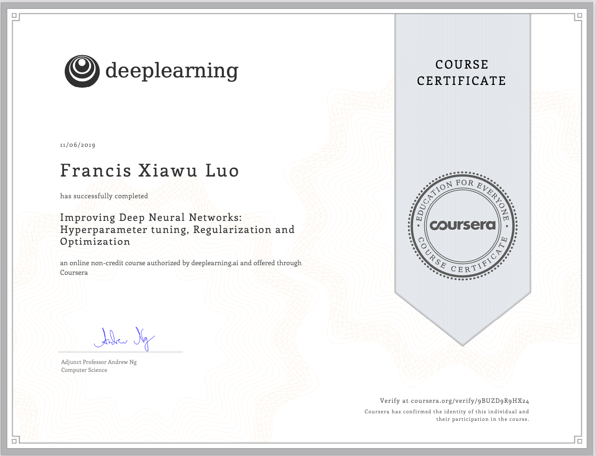

# Improving Deep Neural Networks

Hyperparameter tuning, Regularization and Optimization

# Introduction

In the second course of the Deep Learning Specialization, you will open the deep learning black box to understand the processes that drive performance and generate good results systematically. 

By the end, you will learn the best practices to train and develop test sets and analyze bias/variance for building deep learning applications; be able to use standard neural network techniques such as initialization, L2 and dropout regularization, hyperparameter tuning, batch normalization, and gradient checking; implement and apply a variety of optimization algorithms, such as mini-batch gradient descent, Momentum, RMSprop and Adam, and check for their convergence; and implement a neural network in TensorFlow.

The Deep Learning Specialization is our foundational program that will help you understand the capabilities, challenges, and consequences of deep learning and prepare you to participate in the development of leading-edge AI technology. It provides a pathway for you to gain the knowledge and skills to apply machine learning to your work, level up your technical career, and take the definitive step in the world of AI.

# Contents

* Practical Aspects of Deep Learning

* Optimization Algorithms

* Hyperparameter Tuning, Batch Normalization and Programming Frameworks

# Certificate

 
