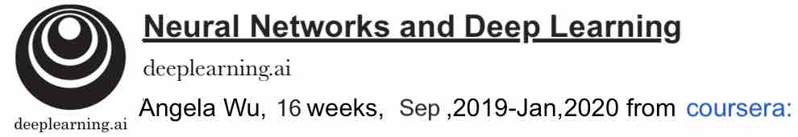
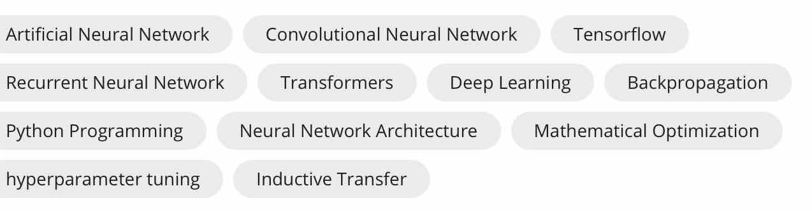

## Neural Networks and Deep Learning

  

The **Deep Learning Specialization** is a foundational program that will help you understand thcapabilities, challenges, and consequences of deep learning and prepare you to participate in the development of leading-edge AI technology. 
In this Specialization, you will build and train neural network architectures such as Convolutional Neural Networks, Recurrent Neural Networks, LSTMs, Transformers, and learn how to make them better with strategies such as Dropout, BatchNorm, Xavier/He initialization, and more. Get ready to master theoretical concepts and their industry applications using Python and TensorFlow and tackle real-world cases such as speech recognition, music synthesis, chatbots, machine translation, natural language processing, and more.
AI is transforming many industries. The Deep Learning Specialization provides a pathway for you to take the definitive step in the world of AI by helping you gain the knowledge and skills to level up your career. Along the way, you will also get career advice from deep learning experts from industry and academia. 
**Skills learned:**
 

# Contents Instroduction
* This is my assignment on Andrew Ng's special course  "[Deep Learning Specialization](https://www.coursera.org/specializations/deep-learning)" This special course consists of five courses: 
    * [Neural Networks and Deep Learning](https://www.coursera.org/learn/neural-networks-deep-learning/home/welcome)  
    * [Improving Deep Neural Networks: Hyperparameter tuning, Regularization and Optimization](https://www.coursera.org/learn/deep-neural-network/home/welcome) 
    * [Structuring Machine Learning Projects](https://www.coursera.org/learn/machine-learning-projects/home/welcome)
    * [Convolutional Neural Networks](https://www.coursera.org/learn/convolutional-neural-networks)
    * [Sequence Models](https://www.coursera.org/learn/nlp-sequence-models)
    
* [Neural Networks and Deep Learning](https://www.coursera.org/learn/neural-networks-deep-learning/home/welcome)
    * In this course, you will learn the foundations of deep learning. When you finish this class, you will:
        * Understand the major technology trends driving Deep Learning
        * Be able to build, train and apply fully connected deep neural networks 
        * Know how to implement efficient (vectorized) neural networks 
        * Understand the key parameters in a neural network's architecture 
      
    * This course also teaches you how Deep Learning actually works, rather than presenting only a cursory or surface-level description. So after completing it, you will be able to apply deep learning to a your own applications. If you are looking for a job in AI, after this course you will also be able to answer basic interview questions. 
    
    * Programming Assignments:
        * Python Basics with Numpy   [[notebook]]()   [[py]]()
        * Logistic Regression with a Neural Network mindset v3  [[notebook]]()   [[py]]()
        * Planar data classification with one hidden layer v3   [[notebook]]()   [[py]]()
        * Building your Deep Neural Network Step by Step v3   [[notebook]]()   [[py]]()
        * Deep Neural Network Application v3   [[notebook]]()   [[py]]()
        
* [Improving Deep Neural Networks: Hyperparameter tuning, Regularization and Optimization](https://www.coursera.org/learn/deep-neural-network/home/welcome) 
    * When you finish this class, you will:
        * Understand industry best-practices for building deep learning applications. 
        * Be able to effectively use the common neural network "tricks", including initialization, L2 and dropout regularization, Batch normalization, gradient checking, 
        * Be able to implement and apply a variety of optimization algorithms, such as mini-batch gradient descent, Momentum, RMSprop and Adam, and check for their convergence. 
        * Understand new best-practices for the deep learning era of how to set up train/dev/test sets and analyze bias/variance
        * Be able to implement a neural network in TensorFlow. 
    * Programming Assignments:
        * Initialization   [[notebook]]()    [[py]]()
        * Regularization   [[notebook]]()   [[py]]()
        * Gradient Checking   [[notebook]]()   [[py]]()
        * Optimization   [[notebook]]()   [[py]]()
        * Tensorflow Tutorial   [[notebook]]()   [[py]]()
        
* [Structuring Machine Learning Projects](https://www.coursera.org/learn/machine-learning-projects/home/welcome)
    * You will learn how to build a successful machine learning project. If you aspire to be a technical leader in AI, and know how to set direction for your team's work, this course will show you how.Much of this content has never been taught elsewhere, and is drawn from my experience building and shipping many deep learning products. This course also has two "flight simulators" that let you practice decision-making as a machine learning project leader. This provides "industry experience" that you might otherwise get only after years of ML work experience.
    * When you finish this class, you will:
        * Understand how to diagnose errors in a machine learning system, and be able to prioritize the most promising directions for reducing error.
        * Understand complex ML settings, such as mismatched training/test sets, and comparing to and/or surpassing human-level performance
        * Know how to apply end-to-end learning, transfer learning, and multi-task learning
* [Convolutional Neural Networks](https://www.coursera.org/learn/convolutional-neural-networks/home/welcome)
   * This course will teach you how to build convolutional neural networks and apply it to image data. Thanks to deep learning, computer vision is working far better than just two years ago, and this is enabling numerous exciting applications ranging from safe autonomous driving, to accurate face recognition, to automatic reading of radiology images. 
   * When you finish this class,you will:
      * Understand how to build a convolutional neural network, including recent variations such as residual networks.
      * Know how to apply convolutional networks to visual detection and recognition tasks.
      * Know to use neural style transfer to generate art.
      * Be able to apply these algorithms to a variety of image, video, and other 2D or 3D data.
    * Programming Assignments:
      * Convolutional Model:step by step   [[notebook]]()    [[py]]()
      * Convolution model Application    [[notebook]]()    [[py]]()
      * Keras Tutorial Happy House       [[notebook]]()    [[py]]()
      * Residual Networks       [[notebook]]()    [[py]]()
      * Autonomous driving application Car detection       [[notebook]]()    [[py]]()
      * Art Generation with Neural Style Transfer       [[notebook]]()    [[py]]()
      * Face Recognition for the Happy House       [[notebook]]()    [[py]]()
* [Sequence Models](https://www.coursera.org/learn/nlp-sequence-models/home/welcome)
   * This course will teach you how to build models for natural language, audio, and other sequence data. Thanks to deep learning, sequence algorithms are working far better than just two years ago, and this is enabling numerous exciting applications in speech recognition, music synthesis, chatbots, machine translation, natural language understanding, and many others. 
   * When you finish this class,you will:
      * Understand how to build and train Recurrent Neural Networks (RNNs), and commonly-used variants such as GRUs and LSTMs.
      * Be able to apply sequence models to natural language problems, including text synthesis.
      * Be able to apply sequence models to audio applications, including speech recognition and music synthesis.
    * Programming Assignments:
      * Building a Recurrent Neural Network Step by Step   [[notebook]]()    [[py]]()
      * Dinosaurus Island Character level language model   [[notebook]]()    [[py]]()
      * Operations on word vectors   [[notebook]]()    [[py]]()
      * Emojify   [[notebook]]()    [[py]]()
      * Neural machine translation with attention   [[notebook]]()    [[py]]()
      * Trigger word detection   [[notebook]]()    [[py]]()
