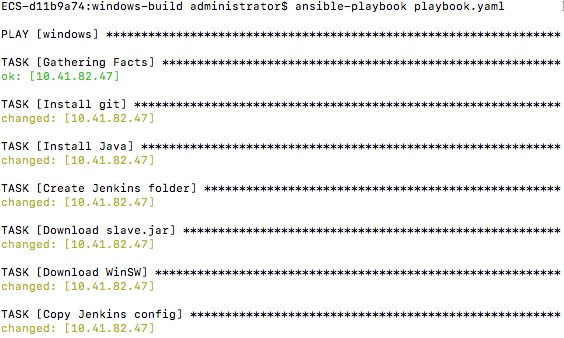

# project: ansible-factory-design-utilities-playbook

Ansible playbook for setting up and configuring build machine for factory-design-utilities

  
 

## 1. Pre-requisites

Please create new instance(s) and attach a new volume to each through ECS Vapor prior to running a playbook. You will need the IP address(es) of the instance(s) you have created. After that, run the following steps:

1. Perform first login to the instance via ECS Vapor Console, as the local administrator
2. Change default password to new password (search for **FDU ECS instance new admin password** on the [Secret Server](https://secrets.autodesk.com/))
3. Download a copy of `bootstrap/presetup.ps1` to the instance and run it
4. When the script has finished running, delete it and close the console session
5. Raise an [ESC ticket](https://engineering.autodesk.com/esc/) to #teach-ci-cd team on creating a new jenkins node on [master-5](https://master-5.jenkins.autodesk.com/computer/), like [ESC-24802](https://jira.autodesk.com/browse/ESC-24802).

## 2. HashiCorp Vault

Playbooks in this repository use credentials and secrets stored in HashiCorp Vault.

## 3. Setup Docker environment to run playbook

factory-design-utilities Ansible control node is generated by docker file, running playbook to setup instance.

### On Mac/Linux/Windows 10

1. Install Docker.

2. Clone the ansible-factorydesignutilities-playbook repository.

3. Edit `hosts` and enter the IP address(es) under the **[ecs]** group name:

   ```bash
   nano hosts
   ```

   e.g.:

   ```ini
   [ecs]
   10.41.116.235 hostname="FDU_Win_VS2019_02" region=USWEST labels="FDU_Win_VS2019"
   ```

4. Create a file `.vault-token.txt` and enter the login token of any user that can access HashiCorp Vault in local ansible-factorydesignutilities-playbook repository, contents are like:

   ```
   s.f6XXXqXXX<example>XXXXXnf
   ```

5. In the ansible-factorydesignutilities-playbook dir, run below script to build docker image:

   ```
   docker build -t ansible-factorydesignutilities-playbook .
   ```

6. In the ansible-factorydesignutilities-playbook dir, run below scrip to start running playbook:

   a) For Mac/Linux:

   ```
   bash run_ansible.sh
   ```

   b) For Windows 10: 

   ```
   run_ansible.bat
   ```

#### Windows earlier version is not recommended


Shortly after the play has finished, a new Jenkins node can be online in the Jenkins master.

At this point, you are ready to trigger a Jenkins build for Factory Design Utilities.

