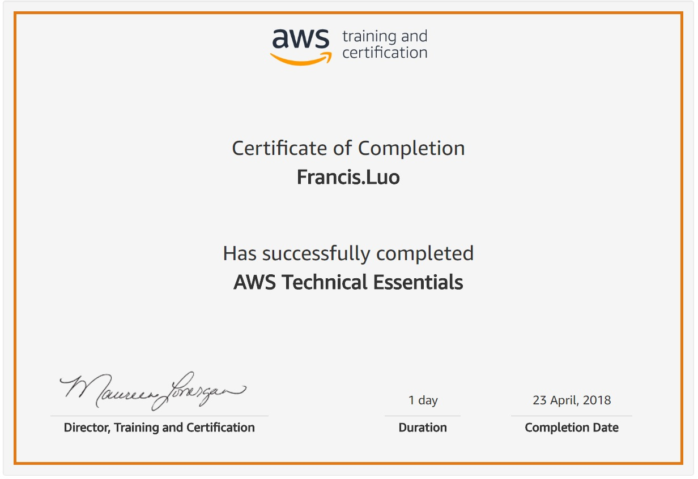

# AWS Technical Essentials

AWS Technical Essentials introduces you to AWS products, services, and common solutions. 

It provides you with fundamentals to become more proficient in identifying AWS services so that you can make informed decisions 
about IT solutions based on your business requirements and get started working on AWS.

## Course Objectives

This course teaches you how to:

*	Recognize terminology and concepts as they relate to the AWS platform and navigate the AWS Management Console.

*	Understand the foundational services, including Amazon Elastic Compute Cloud (EC2), Amazon Virtual Private Cloud (VPC), Amazon Simple Storage Service (S3), and Amazon Elastic Block Store (EBS).

*	Understand the security measures AWS provides and key concepts of AWS Identity and Access Management (IAM).

*	Understand AWS database services, including Amazon DynamoDB and Amazon Relational Database Service (RDS).

*	Understand AWS management tools, including Auto Scaling, Amazon CloudWatch, Elastic Load Balancing (ELB), and AWS Trusted Advisor.

## Intended Audience

This course is intended for:

*	Individuals responsible for articulating the technical benefits of AWS services to customers
*	Individuals interested in learning how to get started with using AWS
*	SysOps administrators, Solution Architects and developers interested in using AWS services

## Delivery Method

This course is delivered through a mix of instructor-led training (ILT) and hands-on labs.
Hands-On Activity

This course allows you to test new skills and apply knowledge to your working environment through a variety of practical exercises.

## Course Outline

This course covers the following concepts:
*	Introduction and History of AWS
*	AWS Foundational Services: EC2, VPC, S3, EBS
*	AWS Security, Identity, and Access Management: IAM
*	AWS Databases: RDS, DynamoDB
*	AWS Management Tools: Auto Scaling, CloudWatch, Elastic Load Balancing, Trusted Advisor

 
## Venue: 

1 Fusionopolis Walk, #04- 11 Solaris North Tower, Singapore 138628 Fusionopolis Walk, Singapore 138628

## Certificate
   
