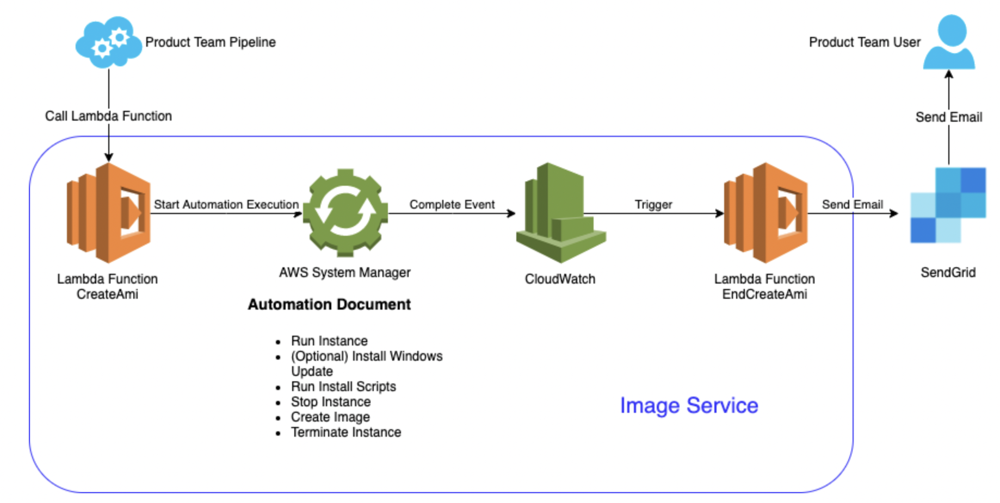

# Image Service Components

  

This automation document includes these steps:

  * Run Instance
  * Install Windows Update
  * Run Install Scripts
  * Stop instance
  * Create Image
  * Terminate Instance
