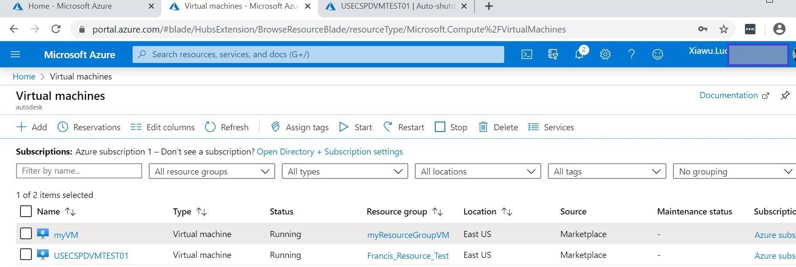
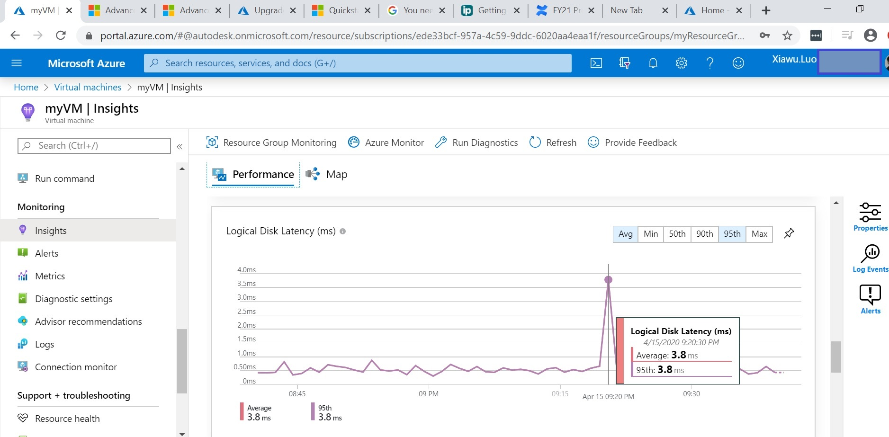
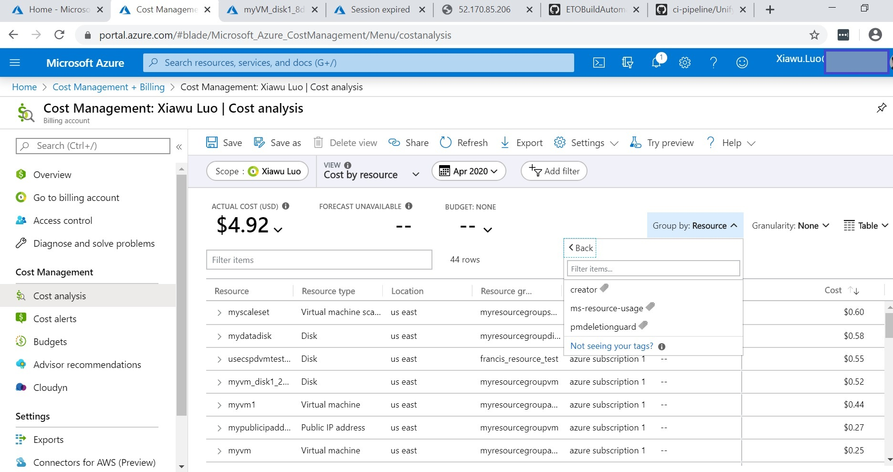

# Azure Learn Modules/tour-azure-portal

  

1.Manage.VM

2.Manage.disks

3.VM.Custom Script Extension

4.VM.Create.a.custom.image

  

5.VM.Create and deploy highly available virtual machines

6.VM.VM Scale Set

7.Load balance Windows VM

  

8.Manage VMs-governance

9.Track and Update VM

10.Management groups

11.Azure governance

12.Azure Advisor

13.Monitor VMs

14.Sizes for Windows virtual machines in Azure
