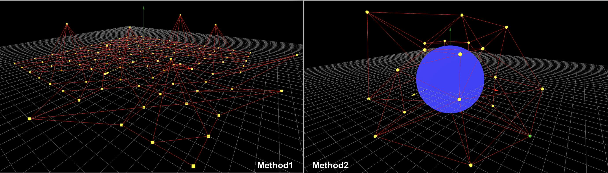
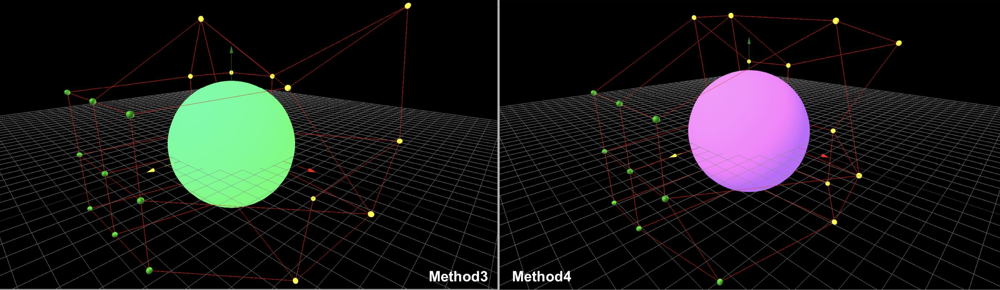

# Interactive Editing: Four Methonds on Dragging Control Points

During FFD implementation, summarize four methods for dragging control points in interactive mesh editing. 

Method 1 & 4 are basic ways, method 2 & 3 are concise and roubst

* M1: Draw control points and lines on a three js 2D plane.
* M2: Draw control points and lines on a three js BoxGeometry
* M3: Use 3D grid methods to darw controls points and linessegments in 3D direction
* M4: Basic method, by calculating control points and lines postions with algorithm, then draw them.
 
  

## Techniques
* Press _'shift'_ to select multiple control points 
* Press _'control'_ to select adjecent control points

## Dev environment

This project was bootstrapped nginx,alpine with docker environment.

### Build

    docker-compose build

### Run

    docker-compose up

Open [http://localhost:8060](http://localhost:8060) to view it in the browser.

### Stop

    docker-compose down
