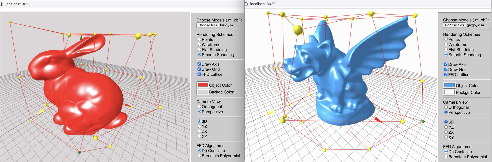

# FFD-Translate from C++ to Javascript WebGL

FFD in the the disertation for NTU graduation is implemented in C++, this project is to translate it into web services.
Implemented by html (web UI part), JavaScript plus WebGL languages.

     

## Techniques

FFD, free-form, deformation, half-tree, lattice, mesh/obj files, threejs, WebGL, JavaScript, html web UI
3D, graphics, modeling, surfaces, normlas, wireframe, flat, decasteljau, bernstein polynomial, lerp, controlpoints
3D views setup (Canvas, Camera, Scene), interactive editing, mouse pick up points, Raycaster, drag elements
World coordinate, local coordinate, screen coordinate, perspectiveCamera, orthographicCamera

## Dev environment

This project was bootstrapped nginx,alpine with docker environment.

### Build

    docker-compose build

### Run

    docker-compose up

Open [http://localhost:8020](http://localhost:8020) to view it in the browser.

### Stop

    docker-compose down
