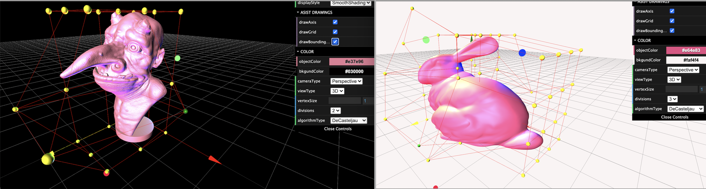

# Free Form Deformation

Free-form deformation with DeCasteljau/bernstein polynomial algorithms based on contents in NTU DM6101 class.
Implemented by JavaScript plus WebGL languages.

   
 
## Features
* Load _*.m/*.obj_ file, different eye/camera view types, different color choices for model and background
* Control Points: Press _'shift'_ to select multiple control points, Press _'control'_ to select adjecent control points
* Refer to GUI for more features, like: different rendering model types _WIRE, FLAT, SMOOTH_ etc.
                  
## Techniques

FFD, free-form, deformation, half-tree, lattice, mesh/obj files, threejs, WebGL, JavaScript
3D, graphics, modeling, surfaces, normlas, wireframe, flat, decasteljau, bernstein polynomial, lerp, controlpoints
3D views setup (Canvas, Camera, Scene), interactive editing, mouse pick up points, Raycaster, drag elements
World coordinate, local coordinate, screen coordinate, perspectiveCamera, orthographicCamera

## Dev environment

This project was bootstrapped nginx,alpine with docker environment.

### Build

    docker-compose build

### Run

    docker-compose up

Open [http://localhost:8030](http://localhost:8030) to view it in the browser.

### Stop

    docker-compose down
