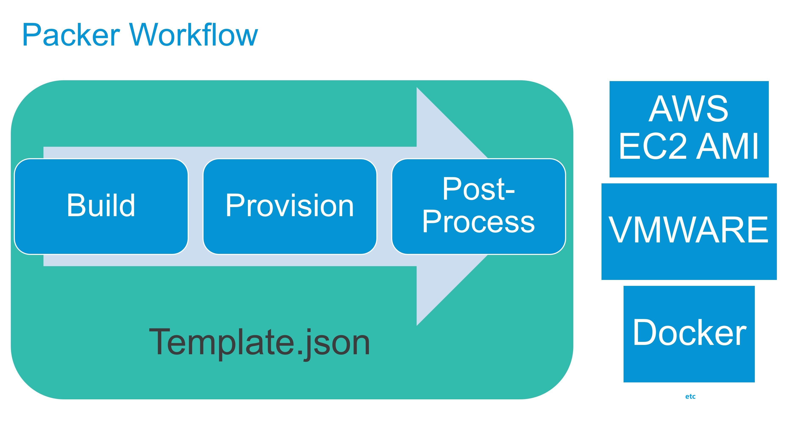

# AMI with Packer

An AMI, or Amazon Machine Image is a template that describes an instance

Packer is a tool for building virtual machine images, builds on top of a hypervisor (AWS, VMWARE, or even Docker)

Talks to hypervisor to create a virtual machine from source (AMI,ISO or any disk image)

Builds and save virtual machine image for future use

 

