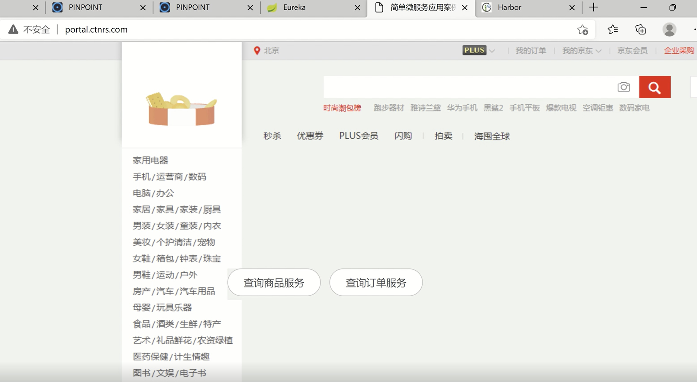
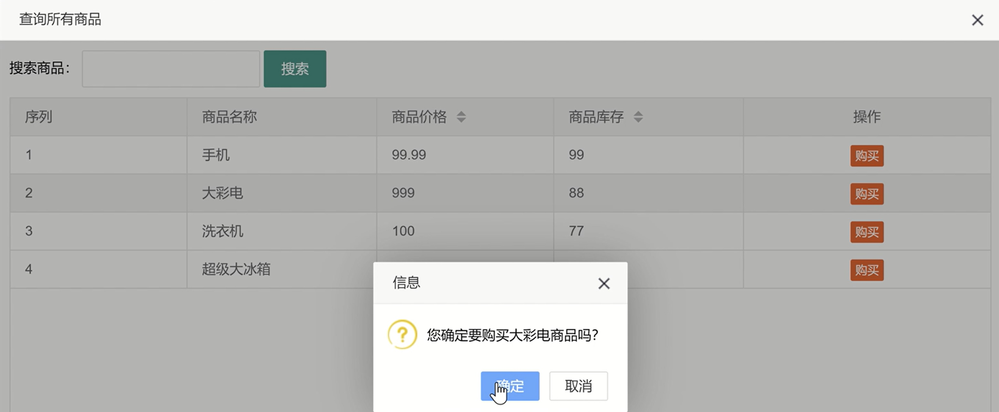
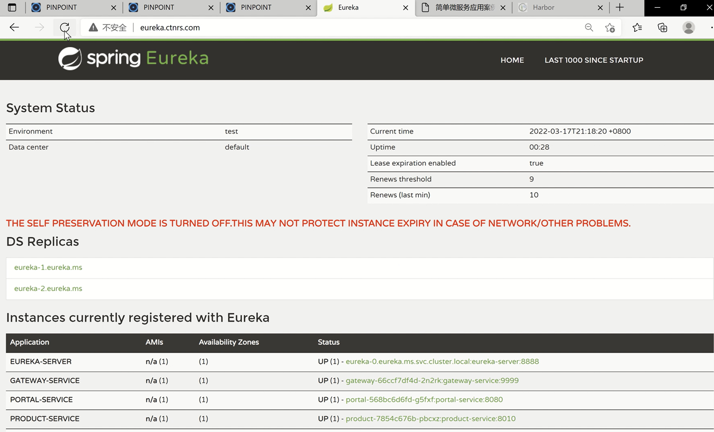

### XI. Setup DevOps Platform for *Graphic Editing System* and *Chinese Speech Recognition System* with Kubernetes Cluster

Both systems are implemented with service on the Dockers originally, in my spare time, I migrate them to the k8s platform with gitlab, Jenkins and harbor server, the purpose is to practise using k8s, gitlab and harbor to form DevOps platform that many companies are using in China mainland.

•	Role: PI　　　　　　　　　　　　　　　　　　　　　　　　　　　　　　　　　　　Time: from June 2021

•	Main CICD process/pipeline stages

I push commits to gitlab, Jenkins feels this with webbook, call k8s api to create Jenkins worker pods, which will run pipeline stages:
Initial task, sync-source code, compile solutions, sonarqube scan, create docker image, push to the harbour server, deploy it to stage branch, deploy it to production branch.

•	Major functions:

1.)	Set up harbor private server for storing docker images.

2.)	Set up Kubernetes cluster platform with binary method (2 masters + 2 nodes).

3.)	Apply Keepalived and Nginx to implement HA for masters nodes.

4.)	Set up Kibana dashboard with EFK tools to watch logs.

5.)	Utilize Prometheus, Grafana and Alertmaner to set up monitor system.

6.)	Notify alerts to DEV team by email or DingDing channel.

7.) Rancher to manage k8s clusters

### XII. Migrate SpringCloud based e-Shopping Platform to K8s

Analyse all components used in the existed e-Shopping platform, identify the respective components in the Kubernetes, design the whole deployment process in k8s, migrate the SpringCloud based components into k8s with service orchestration.

•	Role: PI　　　　　　　　　　　　　　　　　　　　　　　　　　　　　　　　　　　Time: from Nov 2021

•	Major functions:

1.)	Install MySQL and migrate existed database/tables into K8s node.

2.)	Set up harbor private server for storing docker images.

3.)	Setup pinPoint server to perform tracing analysis for all modules.

4.)	Set up Kubernetes cluster platform with kubeadm method (2 masters + 2 nodes).

5.)	Apply Keepalived and Nginx to implement HA for masters nodes.

6.)	Utilize Ingress/Ingress-controller/Service perform load balance.

7.)	Compile/Build/Package original Java source code in k8s node.

8.)	Deploy Eureka components into K8s node.

9.)	Deploy Gateway service into k8s

10.) Deploy Portal, order, product and stock services into K8s node.

11.) Auto-scaling pods implementation in k8s.

•	Demo

Online Shop Platform

 

Stocks

 

Eureka

 
