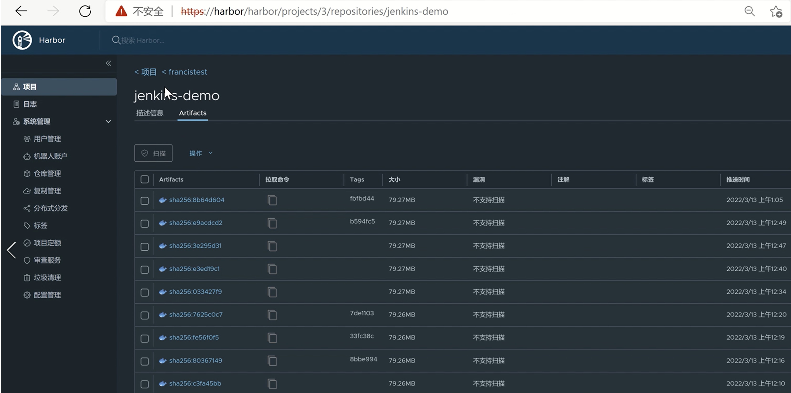
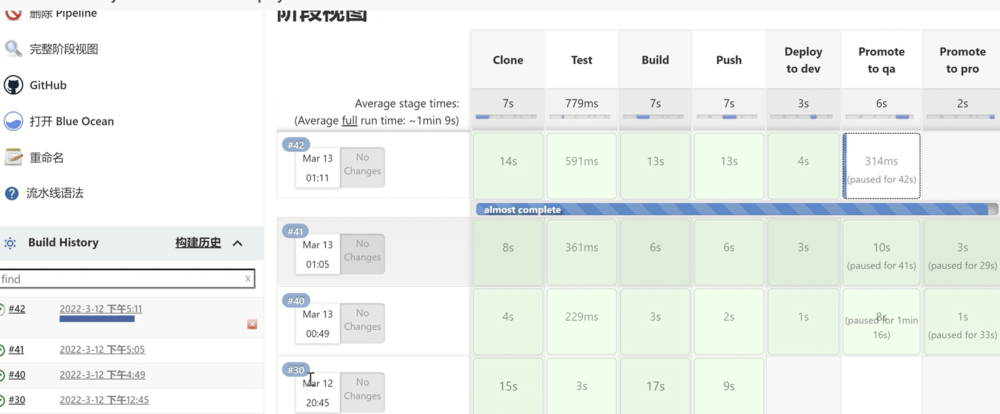

# Demo: Jenkins+k8s+Git+harbor for eto ci-cd project

## k8s-cicd-process
Dev submit code to GitLab, gitlab-→jenkins monitors code updated-→call k8s api to create jenkins slave pod in k8s.

Jenkins slave pod pull source code---→compile and generate war or jar package by Marven	-->

upload source code to Sonarqube, scan silently - --> build docker image with Jar/war package 

-->upload images to the harbor server -> delply to QA/STG environment-> deploy to Prod environment.

## demo

  
 
 
   
