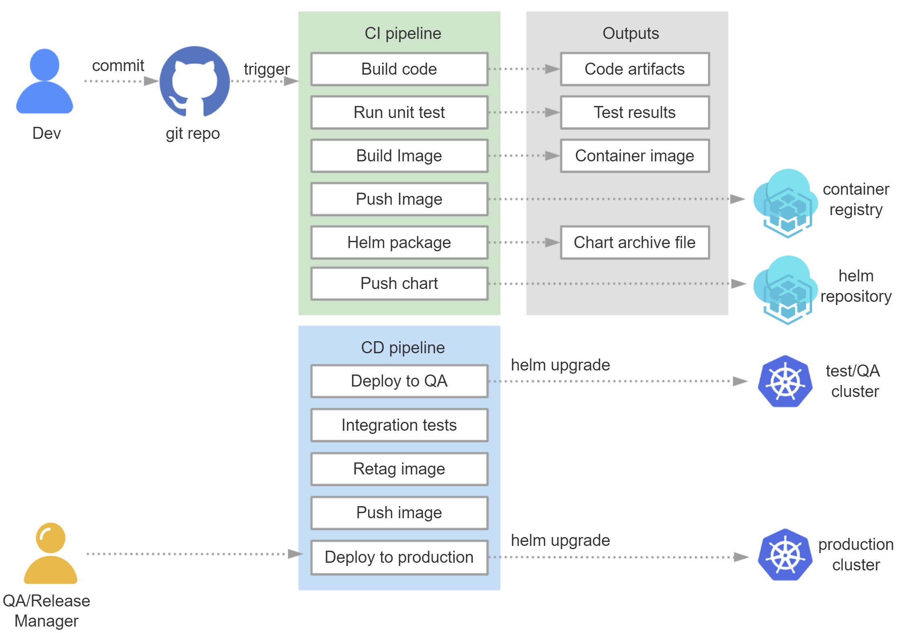

# Migrate ETO Component CI/CD build process from VM to K8s Platform

## Jenkins+k8s+Git+harbor ci-cd process

 
 
Dev submit code to GitLab, gitlab &#8594; jenkins monitors code updated &#8594; call k8s api to create jenkins slave pod in k8s.

Jenkins worker pod pull source code &#8594; compile and generate war or jar package by Marven	&#8594; upload source code to Sonarqube, scan silently &#8594; build docker image with Jar/war package &#8594; upload images to the harbor server &#8594; delply to QA/STG environment &#8594; deploy to Prod environment.

## demo

container register-harbor server
 
  
 
Jenkins pipeline
 
   
