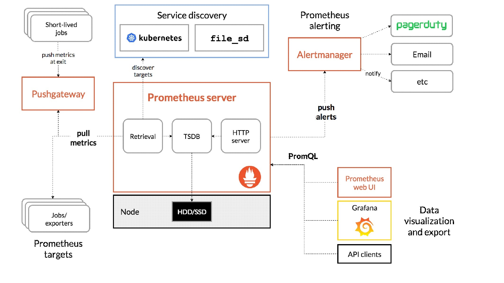
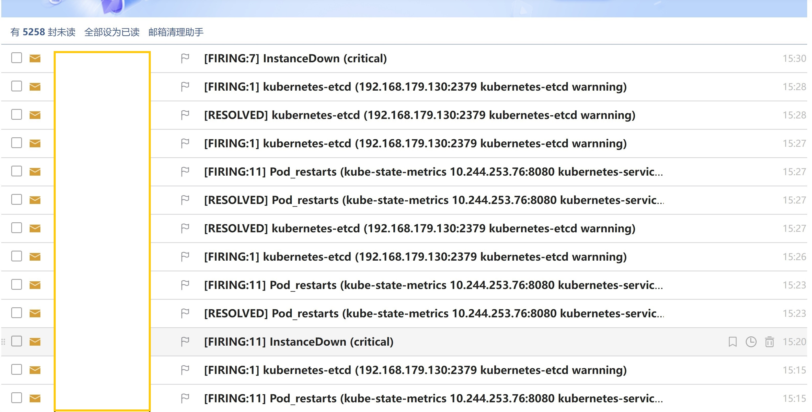

# Migrate micro-services from Separated Dockers to Kubernetes cluster with HA of master nodes and monitor system

Prometheus, Grafana and Alertmaner

 

Prometheus, Grafana dashboar

Kibana dashboard with EFK

Notify committer with job results by email

