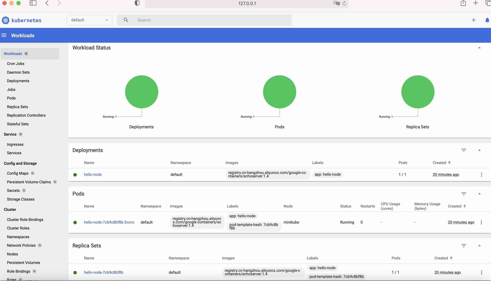

# Create a Deployment

1. $ kubectl create deployment hello-node --image=registry.cn-hangzhou.aliyuncs.com/google_containers/echoserver:1.4
```
deployment.apps/hello-node created
```
 

2. $ kubectl delete deployment hello-node
```
deployment.apps "hello-node" deleted
```
# Create a service

3. $ kubectl expose deployment hello-node --type=LoadBalancer --port=8080

4. $ kubectl get services
```
NAME         TYPE           CLUSTER-IP     EXTERNAL-IP   PORT(S)          AGE
hello-node   LoadBalancer   10.97.247.80   <pending>     8080:32419/TCP   3m38s
kubernetes   ClusterIP      10.96.0.1      <none>        443/TCP          5h12m
```

5. $ minikube service hello-node
```
|-----------|------------|-------------|---------------------------|
| NAMESPACE |    NAME    | TARGET PORT |            URL            |
|-----------|------------|-------------|---------------------------|
| default   | hello-node |        8080 | http://192.168.67.2:32419 |
|-----------|------------|-------------|---------------------------|
🏃  Starting tunnel for service hello-node.
|-----------|------------|-------------|------------------------|
| NAMESPACE |    NAME    | TARGET PORT |          URL           |
|-----------|------------|-------------|------------------------|
| default   | hello-node |             | http://127.0.0.1:49369 |
|-----------|------------|-------------|------------------------|
🎉  Opening service default/hello-node in default browser...
```
# Enable/disable addons

6. $ minikube addons enable metrics-server
```
🌟  The 'metrics-server' addon is enabled
```

7. $ kubectl get pod,svc -n kube-system
```
NAME                                   READY   STATUS    RESTARTS      AGE
pod/coredns-7d89d9b6b8-zd2l9           1/1     Running   0             24h
pod/etcd-minikube                      1/1     Running   0             24h
pod/kube-apiserver-minikube            1/1     Running   0             24h
pod/kube-controller-manager-minikube   1/1     Running   0             24h
pod/kube-proxy-cvkqk                   1/1     Running   0             24h
pod/kube-scheduler-minikube            1/1     Running   0             24h
pod/metrics-server-799c994c89-46dv4    1/1     Running   0             96s
pod/storage-provisioner                1/1     Running   1 (12h ago)   24h

NAME                     TYPE        CLUSTER-IP     EXTERNAL-IP   PORT(S)                  AGE
service/kube-dns         ClusterIP   10.96.0.10     <none>        53/UDP,53/TCP,9153/TCP   24h
service/metrics-server   ClusterIP   10.106.67.18   <none>        443/TCP                  96s
```
9. $ minikube addons disable metrics-server
```
The 'metrics-server' addon is disabled
```

10. $ curl http://172.17.0.107:32423 

&emsp;&emsp;[Verifying this on the Katacoda, since it's not supported in Mac M1 machine]

```
CLIENT VALUES:
client_address=172.18.0.1
command=GET
real path=/
query=nil
request_version=1.1
request_uri=http://172.17.0.107:8080/

SERVER VALUES:
server_version=nginx: 1.10.0 - lua: 10001

HEADERS RECEIVED:
accept=*/*
host=172.17.0.107:32423
user-agent=curl/7.58.0
BODY:
-no body in request
```

# Cleanup

11. $ kubectl delete service hello-node
```
service "hello-node" deleted
```

12. $ kubectl delete deployment hello-node
```
deployment.apps "hello-node" deleted
```

13 $ minikube stop
```
✋  Stopping node "minikube"  ...
🛑  Powering off "minikube" via SSH ...
🛑  1 node stopped.
```

14 $ minikube delete
```
🔥  Deleting "minikube" in docker ...
🔥  Deleting container "minikube" ...
🔥  Removing /Users/luoxi/.minikube/machines/minikube ...
💀  Removed all traces of the "minikube" cluster.
```

# Issues

1. Only docker driver is supported on Mac M1, which will cause an error:
   ```
   🎉  Opening service default/hello-node in default browser...
   ❗  Because you are using a Docker driver on darwin, the terminal needs to be open to run it.
   ```
   reference [here](https://github.com/kubernetes/minikube/issues/9016)
