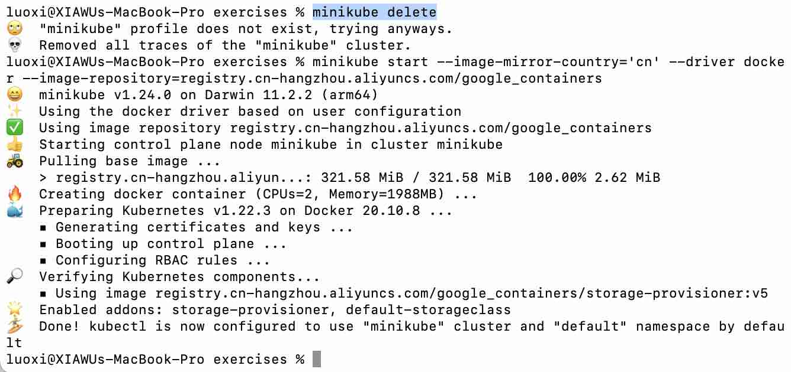

# k8s demo

## Installation guide on Mac OS

1. $curl -Lo kubectl https://storage.googleapis.com/kubernetes-release/release/v1.6.4/bin/linux/amd64/kubectl
chmod +x kubectl

2. $bin/zsh -c "$(curl -fsSL https://gitee.com/cunkai/HomebrewCN/raw/master/Homebrew.sh)"

3. $brew install minikube

4. $curl -LO https://storage.googleapis.com/minikube/releases/latest/docker-machine-driver-hyperkit && chmod +x docker-machine-driver-hyperkit && sudo mv docker-machine-driver-hyperkit /usr/local/bin/ && sudo chown root:wheel /usr/local/bin/docker-machine-driver-hyperkit && sudo chmod u+s /usr/local/bin/docker-machine-driver-hyperkit

5. $brew install docker-machine-driver-hyperkit

6. $brew link minikube

7. $minikube delete

8. $minikube start --image-mirror-country='cn' --driver docker --image-repository=registry.cn-hangzhou.aliyuncs.com/google_containers

  It comes the successful result:

   
